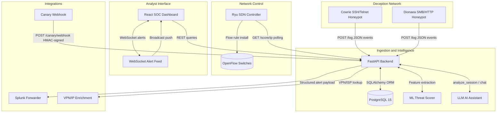
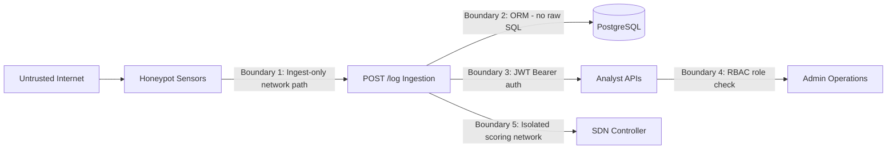

# Architecture Overview

This document explains how all components of EvilTwin fit together, where the trust boundaries are, and how data flows from attacker keyboard to SOC analyst screen.

:::tip Reading this for the first time?
Start with the [logical architecture diagram](#logical-architecture) for the big picture, then read the [data flow walkthrough](#end-to-end-data-flow) which narrates each step in plain English.
:::

---

## What Is EvilTwin?

EvilTwin is a **cyber deception platform**. It presents fake services (honeypots) to attackers, records everything they do, analyses the behaviour with AI, and gives security teams real-time intelligence.

The core insight: traditional firewalls block known threats. EvilTwin *invites* attackers in, watches what they do, and uses that intelligence to understand their techniques before they reach real systems.

---

## Logical Architecture

The platform has five layers, each with a distinct responsibility:



**Layer summary:**

| Layer | Components | Responsibility |
|---|---|---|
| Deception | Cowrie, Dionaea | Present fake services; capture attacker commands, credentials, files |
| Intelligence | Backend, PostgreSQL, ML model, LLM | Ingest events, score threats, analyse tactics, store everything |
| Network control | SDN Controller, OpenFlow switches | Redirect or isolate suspicious IPs at the network level |
| Analyst interface | React dashboard, WebSocket feed | Real-time visibility; session forensics; AI-assisted triage |
| Integrations | Splunk, Canary, VPN enrichment | SIEM forwarding; physical trap alerts; IP reputation context |

---

## Why This Architecture?

### Separation of Concerns
Honeypots, scoring, UI, and SDN are fully isolated. This means:
- A crashed ML model doesn't stop event ingestion
- A new honeypot type (e.g. RDP) can be added without touching the SDN code
- The UI can be replaced without touching the backend

### Defence in Depth
Attackers who compromise a honeypot see **only** the internal sensor network. They cannot reach the PostgreSQL database, the SDN controller, or any other platform component. This is enforced at the network level.

### Operational Resilience
Every subsystem degrades gracefully:
- ML model missing → returns `(0.0, level 0)`, ingestion continues
- VPN enrichment API down → records `vpn_detected: false`, continues
- LLM unavailable → returns 503 on AI endpoints, everything else works
- PostgreSQL unreachable → health endpoint reports failure, returns 503

---

## Trust Boundaries

The platform enforces five explicit trust boundaries. Understanding these is essential for secure deployment.



| Boundary | What It Prevents | How It's Enforced |
|---|---|---|
| 1 — Ingest-only path | Honeypot compromise leading to full backend access | Network isolation; only `POST /log` accepts honeypot traffic |
| 2 — ORM layer | SQL injection from hostile attacker payloads | SQLAlchemy parameterised queries; no raw SQL strings |
| 3 — JWT auth | Unauthenticated access to sessions, scores, alerts | JWT Bearer token required on all protected endpoints |
| 4 — RBAC role check | Analysts escalating to admin operations (SDN control) | Role checked on every admin endpoint via FastAPI dependency |
| 5 — SDN network isolation | Attacker influencing SDN controller directly | SDN only reads scores from backend; not directly reachable from honeypot network |

:::warning Never cross these boundaries
Do not co-locate the honeypot network and platform network on the same VLAN. A misconfigured route that lets `POST /log` traffic access `5432/tcp` breaks Boundary 1 and 2 simultaneously.
:::

---

## End-to-End Data Flow

Here is a complete walkthrough of what happens from the moment an attacker connects to a honeypot to when a SOC analyst sees the alert.

```mermaid
sequenceDiagram
    participant A as Attacker
    participant H as Honeypot (Cowrie)
    participant B as Backend (FastAPI)
    participant ML as ML Scorer
    participant LLM as LLM Assistant
    participant D as PostgreSQL
    participant S as SDN Controller
    participant UI as SOC Dashboard

    A->>H: SSH connection + commands
    H->>B: POST /log (JSON event)
    B->>D: Upsert attacker profile; append session event
    B->>ML: Score(session, profile history)
    ML-->>B: threat_score=0.87, level=4 (Critical)
    B->>D: Persist threat score + level
    B-->>UI: WebSocket push: new Critical alert

    Note over B,UI: Analyst sees alert in real time

    S->>B: GET /score/198.51.100.10 (polling)
    B-->>S: level=4, score=0.87
    S->>S: Install OpenFlow redirect rule

    Note over S: Attacker's subsequent packets redirected

    UI->>B: POST /ai/analyze (analyst requests triage)
    B->>LLM: analyze_session(session data)
    LLM-->>B: TTPs, IoCs, recommended_actions
    B-->>UI: Structured forensic analysis
```

**Step-by-step narration:**

1. **Attacker connects** to Cowrie, which presents a fake SSH server and captures every command
2. **Cowrie sends events** as JSON to `POST /log` — one event per command, credential attempt, or file operation
3. **Backend upserts the attacker profile** (first seen, last seen, cumulative behaviour) and appends the event to the session log
4. **ML scorer runs** — extracts a 16-dimensional feature vector and predicts threat class
5. **Score persisted** — the attacker profile's `threat_score` and `threat_level` are updated
6. **Alert broadcast** — if level ≥ 3 (High), the alert manager pushes a message to all connected WebSocket clients
7. **SDN polling** — the Ryu controller periodically queries `/score/{ip}`; if level meets threshold, it installs an OpenFlow redirect rule
8. **Analyst requests AI triage** — `POST /ai/analyze` sends session context to the LLM, which returns MITRE ATT&CK TTPs, IoCs, and recommended actions

---

## Data Contracts

Each layer exchanges data through explicit schemas (Pydantic models) — no ad-hoc dicts or unvalidated strings cross boundaries.

### Honeypot Event Payload (`POST /log`)
```json
{
  "eventid": "cowrie.command.input",
  "src_ip": "203.0.113.10",
  "src_port": 50555,
  "dst_ip": "10.0.2.1",
  "dst_port": 22,
  "session": "sensor-session-uuid",
  "protocol": "ssh",
  "timestamp": "2026-01-01T00:00:00Z",
  "input": "cat /etc/passwd",
  "username": "root",
  "password": "toor"
}
```

### Session Record (PostgreSQL)
- One row in `session_logs` per logical attacker interaction
- References `attacker_profiles` by IP
- Contains aggregated behaviour: commands list, credential attempts, threat score

### Attacker Profile (PostgreSQL)
- One row in `attacker_profiles` per unique source IP
- Longitudinal view: total sessions, cumulative threat score, VPN flag, country, ISP

### Alert Payload (WebSocket)
```json
{
  "type": "alert",
  "session_id": "uuid",
  "src_ip": "203.0.113.10",
  "threat_level": 4,
  "threat_score": 0.87,
  "honeypot": "cowrie",
  "timestamp": "2026-01-01T00:01:30Z"
}
```

---

## Performance and Latency

Critical path targets (see [Observability and SLOs](/dev/observability-and-slos) for full SLO table):

| Path | Target |
|---|---|
| `POST /log` ingestion p95 | < 500ms |
| `GET /score/{ip}` p95 | < 300ms |
| WebSocket alert delivery | < 100ms after ingestion |
| `POST /ai/analyze` | 2–10s (LLM-dependent) |

The ML scorer uses an in-memory TTL cache to avoid re-scoring the same IP on every event. The LLM path is intentionally asynchronous — it is called by analysts, not in the hot ingestion path.
