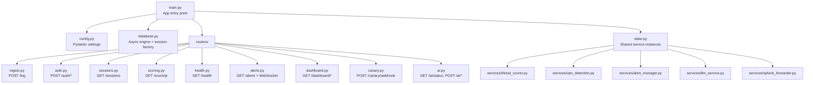
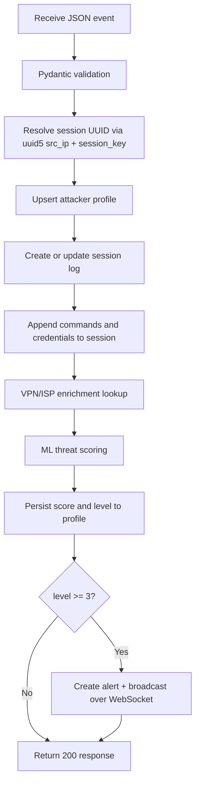
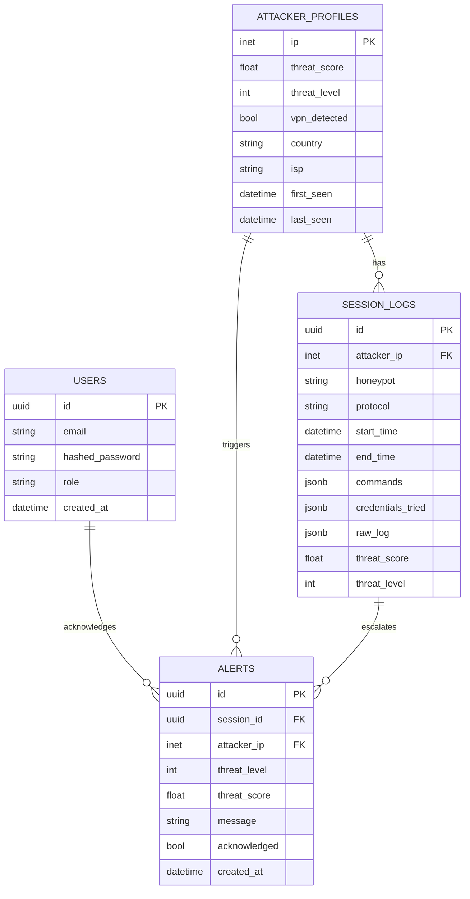

# Backend Design (FastAPI)

## Purpose

The backend is the platform's control and intelligence hub. It:
- Receives honeypot events and stores them in PostgreSQL
- Scores attacker threat using the ML model
- Enriches IPs with VPN/proxy detection
- Serves the SOC dashboard's REST and WebSocket APIs
- Handles all authentication and access control
- Provides AI-assisted forensic analysis via the LLM service

This document explains the module layout, key design patterns, and how auth, scoring, and AI fit together.

---

## Module Layout



---

## Application Lifecycle

FastAPI runs startup/shutdown hooks that initialise and tear down shared resources:

**Startup (in order):**
1. Load and validate all settings from environment variables (Pydantic raises at startup if a required var is missing)
2. Create the async SQLAlchemy engine and session factory
3. Initialise shared service instances: `ThreatScorer`, `VPNDetector`, `AlertManager`, `LLMService`, `SplunkForwarder`
4. Run DB connectivity check (`SELECT 1`) — health endpoint reports failure if this fails
5. Load `model.pkl` into `ThreatScorer` — if missing, scoring degrades gracefully

**Shutdown:**
1. Dispose the database connection pool (releases all pooled connections cleanly)

---

## Authentication System

:::note Why JWT?
JWT (JSON Web Token) is a self-contained authentication mechanism. The server does not need to store sessions in a database — it just verifies the token's cryptographic signature. This makes horizontal scaling trivial.
:::

### Auth Flow

```mermaid
sequenceDiagram
    participant C as Client (browser/curl)
    participant A as POST /auth/login
    participant D as PostgreSQL
    participant P as Protected Endpoint

    C->>A: {username, password}
    A->>D: SELECT user WHERE email=username
    D-->>A: User row (hashed password)
    A->>A: bcrypt verify(password, hash)
    A-->>C: {access_token, refresh_token}

    Note over C: Stores tokens; uses access_token for requests

    C->>P: Authorization: Bearer <access_token>
    P->>P: Verify JWT signature with SECRET_KEY
    P->>P: Check role permission (RBAC)
    P-->>C: 200 OK with data
```

### Auth Endpoints

| Endpoint | Purpose | Auth Required |
|---|---|---|
| `POST /auth/register` | Create a new user account | Admin token |
| `POST /auth/login` | Exchange credentials for tokens | None |
| `POST /auth/refresh` | Get a new access token using refresh token | None (uses refresh_token) |

### Password Security

Passwords are stored as **bcrypt hashes** — never in plaintext. bcrypt is deliberately slow (configurable rounds), making brute-force attacks impractical even if the database is compromised.

### RBAC (Role-Based Access Control)

Every user has a `role` field: `admin` or `analyst`.

| Role | Can Do |
|---|---|
| `admin` | All operations — register users, view all data, manage SDN flows |
| `analyst` | Read-only — view sessions, scores, dashboard, alerts; use AI assistant |

Role is encoded in the JWT payload. The backend verifies it on every protected request via FastAPI dependency injection:

```python
# How RBAC works in routers — FastAPI checks this automatically
async def create_user(
    new_user: UserCreate,
    current_user: User = Depends(require_admin)  # ← raises 403 if not admin
):
    ...
```

### Token Refresh

Access tokens expire after `ACCESS_TOKEN_EXPIRE_MINUTES` (default: 30 minutes). Rather than asking the user to log in again, the frontend automatically calls `POST /auth/refresh` with the long-lived refresh token (default: 7 days).

---

## Ingestion Flow (`POST /log`)

This is the most critical path in the system — every honeypot event goes through here.



**Design decisions:**
- **Stable session identity**: `uuid5(src_ip, session_key)` ensures all events from the same attacker session map to the same database row, even if they arrive out of order
- **Raw log retention**: the original JSON event is stored in `raw_log` (JSONB) alongside structured fields — enables forensic replay
- **Scoring after persistence**: if scoring fails, the event is already saved — no data loss
- **Non-blocking alerts**: WebSocket broadcast uses a queue; it will not block ingestion if no clients are connected

---

## Auth Dependency in FastAPI

FastAPI's dependency injection system makes auth enforcement clean and testable:

```
Request
  └─ Router function
       └─ Depends(get_current_user)
            └─ Decode JWT from Authorization header
                 └─ Depends(require_admin) or Depends(require_analyst)
                      └─ Raise 403 if role insufficient
```

In tests, you can override `get_current_user` to inject a mock user without a real token, keeping testing fast.

---

## LLM Service (`services/llm_service.py`)

`LLMService` is an async wrapper around the OpenAI SDK that builds forensic analysis prompts and parses structured responses.

Key methods:

| Method | Purpose | Called By |
|---|---|---|
| `analyze_session(data)` | Deep TTP/IoC analysis | `POST /ai/analyze` |
| `chat(message, context)` | Conversational follow-up | `POST /ai/chat` |
| `is_available()` | Check LLM connectivity | `GET /ai/status` |

The service is initialised as a singleton in `state.py` at startup. If `LLM_API_KEY` is not set, `is_available()` returns `False` and the router returns HTTP 503 — other platform features continue working.

See [AI Threat Scoring](/dev/ai-threat-scoring) for full details on LLM prompts and response schemas.

---

## Session Query APIs

`GET /sessions` supports server-side filtering and pagination:

| Parameter | Type | Description |
|---|---|---|
| `page` | int | Page number (1-indexed) |
| `page_size` | int | Results per page (max 100) |
| `threat_level` | int | Filter by minimum level (0–4) |
| `honeypot` | string | Filter by sensor name |
| `date_from` / `date_to` | ISO-8601 | Time range filter |
| `ip` | string | Filter by attacker IP |

Response includes `total`, `page`, `page_size`, and `items` — the frontend uses these to render pagination controls.

---

## Dashboard APIs

The dashboard page aggregates data from three endpoints:

| Endpoint | Returns |
|---|---|
| `GET /dashboard/stats` | 24-hour summary — total events, unique IPs, alert count by level |
| `GET /dashboard/timeline` | Time-series data points for trend charts (hourly buckets) |
| `GET /dashboard/top-attackers` | Top 10 attacker IPs sorted by score, event count, or last seen |

---

## WebSocket Alert Feed

The WebSocket endpoint at `/ws/alerts` streams real-time alerts to connected dashboard clients.

**Authentication**: The JWT token is passed as a URL query parameter:
```
ws://localhost:8000/ws/alerts?token=<your-jwt-token>
```

The `AlertManager` service maintains a per-client queue. When a new Critical/High threat is detected during ingestion, it broadcasts to all connected clients concurrently. Queue overflow (client too slow to consume) drops the oldest item rather than blocking the ingestion path.

---

## Data Model



---

## Configuration Strategy

All configuration lives in `config.py` as a Pydantic `BaseSettings` model. This means:
- Every setting is **type-validated** at startup — wrong types raise an error immediately rather than causing mysterious bugs later
- Settings are loaded from environment variables automatically
- Secrets never appear in source code

Key setting groups:
- **Database**: `POSTGRES_*` vars compose into `SQLALCHEMY_DATABASE_URI`
- **JWT**: `SECRET_KEY`, `ALGORITHM`, `ACCESS_TOKEN_EXPIRE_MINUTES`, `REFRESH_TOKEN_EXPIRE_DAYS`
- **LLM**: `LLM_API_KEY`, `LLM_BASE_URL`, `LLM_MODEL`, `LLM_MAX_TOKENS`, `LLM_TEMPERATURE`
- **Canary**: `CANARY_WEBHOOK_SECRET`, `CANARY_WEBHOOK_TOLERANCE_SECONDS`
- **Enrichment**: `IPINFO_TOKEN`, `ABUSEIPDB_API_KEY`

---

## Extension Points

Adding a new capability typically requires:

1. **New honeypot type**: Add an adapter that translates sensor events to the standard `POST /log` schema — no backend changes needed
2. **New enrichment provider**: Implement the enrichment interface in `services/` and wire into `state.py`
3. **New scoring model**: Replace `model.pkl` — `ThreatScorer` is model-agnostic; it just calls `predict_proba()`
4. **New LLM provider**: Set `LLM_BASE_URL` to any OpenAI-compatible endpoint (Anthropic, Groq, local Ollama)
