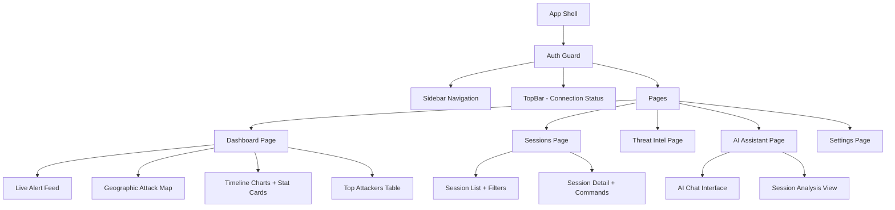
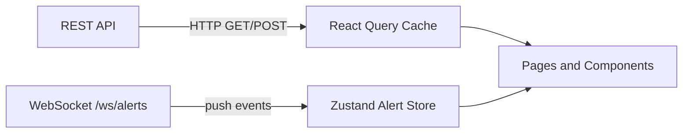

# Frontend Design (SOC Dashboard)

## Purpose

The frontend gives SOC analysts real-time and historical visibility into threat activity. It is the primary interface for:
- Watching live attack alerts as they happen
- Exploring session details and attacker profiles
- Viewing threat statistics and geographic attack distribution
- Using the AI assistant to analyse sessions conversationally

---

## Technology Stack

| Technology | Why Used |
|---|---|
| **React + TypeScript** | Component-based UI with type safety — reduces runtime bugs |
| **Vite** | Fast dev server and build tool (starts in < 1s, HMR is instant) |
| **Tailwind CSS** | Utility-first styling — consistent operator-focused dark theme without custom CSS files |
| **React Query** | Caches REST API responses, handles loading/error states, and auto-refetches |
| **Zustand** | Lightweight state store for the live WebSocket alert stream |
| **Recharts** | Declarative charting for threat timeline, level distribution |
| **react-simple-maps** | SVG world map for geographic attack visualisation |

---

## Authentication Flow

:::note Why auth is required
The dashboard accesses sensitive data (attacker IPs, captured credentials, threat scores). All API calls require a valid JWT token.
:::

### Auth Store (Zustand)

The auth store manages:
- `accessToken` — stored in memory (not localStorage, for XSS protection)
- `refreshToken` — stored in an httpOnly cookie or memory
- `user` — decoded user info (email, role) from JWT payload
- `login(email, password)` — calls `POST /auth/login`, stores tokens
- `logout()` — clears tokens and redirects to login page
- `refreshTokens()` — calls `POST /auth/refresh` with the refresh token

### Token Refresh Interceptor

`axios` (or `fetch`) is wrapped with an interceptor that:
1. Attaches `Authorization: Bearer <accessToken>` to every request
2. On `401 Unauthorized` response: calls `refreshTokens()`
3. Retries the original request with the new token
4. If refresh also fails (refresh token expired): redirects to login

This is invisible to the user — tokens rotate silently in the background.

### Route Guards

Protected pages (dashboard, sessions, threat intel, settings) check for a valid auth token on mount. Unauthenticated users are redirected to `/login`.

---

## Application Architecture



---

## Data Flow and State Management

The frontend uses two separate state systems for two different data patterns:



### Why Two Systems?

| Concern | System | Reason |
|---|---|---|
| REST data (sessions, stats, scores) | React Query | Request/response caching, background refetch, loading states |
| Live alert stream | Zustand | Push-based; alerts should not trigger full query cache invalidations |
| Auth state | Zustand | Global — needs to be read from deeply nested components |

Keeping them separate prevents the WebSocket message storm from causing React Query to re-render all list components on every alert.

---

## WebSocket Connection

The alert WebSocket authenticates via a JWT token in the URL query parameter:

```javascript
// hooks/useAlertWebSocket.ts
const wsUrl = `ws://localhost:8000/ws/alerts?token=${accessToken}`;
const ws = new WebSocket(wsUrl);

ws.onmessage = (event) => {
  const alert = JSON.parse(event.data);
  useAlertStore.getState().addAlert(alert);
};
```

### Reconnect and Backoff Logic

The hook implements **exponential backoff** to handle transient disconnections:
- Attempt 1: reconnect after 1s
- Attempt 2: after 2s
- Attempt 3: after 4s
- …up to a maximum delay (e.g. 30s)

The TopBar displays connection health so analysts know whether silence means no attacks or a broken connection:
- `Connected` (green dot) — receiving events
- `Disconnected` (red dot) — retrying; shows attempt count and next retry time
- `Last event: 3 min ago` — helps distinguish network quiet from connection failure

---

## Sessions Page

The sessions page provides full filtering and pagination over the backend's `/sessions` API.

Implemented filter controls map directly to backend query parameters:

| UI Control | Backend Parameter | Example |
|---|---|---|
| IP address search | `ip` | `203.0.113.10` |
| Threat level dropdown | `threat_level` | `3` (High+) |
| Honeypot selector | `honeypot` | `cowrie` |
| Date range picker | `date_from`, `date_to` | `2026-01-01T00:00:00Z` |
| Results per page | `page_size` | `25` |
| Pagination buttons | `page` | `2` |

Filters are stored in URL query parameters — analysts can bookmark and share filtered views.

---

## AI Assistant Page

The AI page allows analysts to:
1. Select a session from recent high-threat events
2. Call `POST /ai/analyze` to get structured TTP/IoC/recommendation analysis
3. Continue the conversation via `POST /ai/chat` with follow-up questions

The chat interface shows:
- The structured analysis (TTPs as badges, IoCs as tag list, recommendations as checklist)
- A conversation thread for follow-up questions
- A "Copy to clipboard" button for each section (useful for incident tickets)

---

## Visual Design Principles

- **Dark operator theme** — reduces eye strain during long SOC shifts; consistent with security tooling conventions
- **Semantic colour severity** — Benign (grey), Low (blue), Medium (yellow), High (orange), Critical (red) — consistent across all charts, badges, and table rows
- **Monospace for attacker data** — IP addresses, commands, and session IDs use monospace font to distinguish them from prose
- **Dense but legible** — information density matches security analyst expectations; no unnecessary whitespace

---

## Geographic Map

- `react-simple-maps` renders an SVG base world map
- Country-level markers placed using country centroid coordinates derived from `session.country` field
- Marker radius scales with event count; colour reflects threat level
- Clicking a marker filters the session list to that country

---

## Testing Strategy

Tests use **Vitest** (Jest-compatible, Vite-native) and **React Testing Library**:

| Test Area | What Is Tested |
|---|---|
| Alert feed rendering | Zustand store updates render new alert rows correctly |
| Session filters | UI filter interactions produce correct backend query parameters |
| Pagination | Page increment/decrement calls correct `page` value |
| TopBar reconnect | Backoff state renders correct attempt number and countdown |
| Auth guard | Unauthenticated route redirects to `/login` |
| Token refresh | Interceptor retries request with new token after 401 |

Run frontend tests:
```bash
cd frontend
npm test -- --run    # single-pass (CI mode)
npm test             # watch mode (development)
```

---

## Development Notes

- The Vite dev server runs on **port 5173** (not 3000)
- API calls from the frontend go to `http://localhost:8000` — configured in `vite.config.ts` as a proxy to avoid CORS issues during development
- In production, nginx serves both the frontend static files and proxies `/api` to the backend — so the frontend calls relative paths in production
