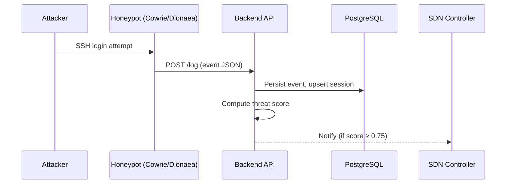

## What Is a Honeypot?

A honeypot is a fake service that looks like a real target (an SSH server, a web form, a database port). It has no legitimate users. Anyone who interacts with it is either a scanner, an attacker, or a misconfigured device.

EvilTwin uses two honeypots:

| Honeypot | What It Simulates | Events It Generates |
| --- | --- | --- |
| **Cowrie** | SSH and Telnet server | Login attempts, commands run, files downloaded |
| **Dionaea** | SMB, FTP, HTTP (malware trap) | Port probes, exploit attempts, payload captures |

Both honeypots detect activity and forward structured events to the EvilTwin backend via `POST /log`. The backend aggregates events into sessions, computes threat scores, and triggers alerts when scores are high.

In the current Docker Compose demo path, Cowrie does not send HTTP requests itself. Instead, the backend mounts the Cowrie log volume read-only at `/logs/cowrie` and tails `cowrie.json` directly. Each JSON line is normalized into the `LogIngestRequest` schema and then passed through the same shared ingestion service used by `POST /log`.

To keep backend traffic on the internal sensor path while still making the honeypots reachable from Kali or another test VM, Docker Compose attaches Cowrie and Dionaea to two networks: the internal `deception-net` and a dedicated `honeypot-ingress` bridge used only for host-published demo ports. This keeps the backend integration stable while preserving the original attacker source IP in the honeypot logs.

:::note
The `/log` ingest endpoint does **not** require JWT authentication. Honeypots run inside the container network and cannot hold tokens. Network isolation (the `internal` Docker network) is the security control here — `/log` is never exposed on the public interface.
:::

---

## Architecture: How Events Flow



---

## Session Identity

All events from a single attacker are grouped into a session. The session is identified by a combination of fields:

| Field | Source | Notes |
| --- | --- | --- |
| `src_ip` | Attacker's IP | Primary grouping key |
| `session` | Honeypot session identifier | Combined with `src_ip` to create a stable UUID |
| `protocol` | `"ssh"`, `"telnet"`, `"ftp"`, `"smb"`, etc. | Part of session context |
| `eventid` | Honeypot event family | Used to infer the honeypot type |

Session boundaries:

- A stable session UUID is generated from `uuid5(src_ip, session)`
- Events from the same attacker across multiple honeypots create **separate sessions** when the honeypot session key differs
- Session updates continue until the honeypot reports the connection closed

---

## Event Schema

```json
{
  "eventid": "cowrie.command.input",
  "src_ip": "203.0.113.7",
  "src_port": 54321,
  "dst_ip": "10.0.2.10",
  "dst_port": 22,
  "session": "cowrie-session-123",
  "protocol": "ssh",
  "message": "uid=0(root) gid=0(root)",
  "input": "id",
  "username": "admin",
  "password": "1234",
  "timestamp": "2024-01-15T10:22:33Z"
}
```

**Required fields:** `eventid`, `src_ip`, `src_port`, `dst_ip`, `dst_port`, `session`, `protocol`, `timestamp`

**Optional fields:** `message`, `input`, `username`, `password`

Event types:

| `event_type` | Honeypot | Meaning |
| --- | --- | --- |
| `cowrie.login.failed` | Cowrie | Failed credential attempt |
| `cowrie.login.success` | Cowrie | Fake shell login accepted |
| `cowrie.command.input` | Cowrie | Command entered in the fake shell |
| `cowrie.session.file_download` | Cowrie | Payload retrieval attempt |
| `dionaea.connection.tcp.accept` | Dionaea | Accepted HTTP/FTP/SMB/MSSQL connection |
| `dionaea.modules.python.ftp.command` | Dionaea | FTP command captured from the client |
| `dionaea.modules.python.ftp.login` | Dionaea | Combined FTP credential attempt captured from the client |
| `dionaea.modules.python.mssql.login` | Dionaea | MSSQL login with client fingerprint metadata |
| `dionaea.modules.python.mssql.cmd` | Dionaea | MSSQL query or batch annotation |
| `dionaea.modules.python.smb.dcerpc.bind` | Dionaea | SMB DCERPC bind annotation |
| `dionaea.modules.python.smb.dcerpc.request` | Dionaea | SMB DCERPC request annotation |

---

## Integration Patterns

### Pattern A — Backend-side Cowrie Log Tailer

Cowrie writes JSON events to its own container volume. The backend mounts that volume at `/logs/cowrie` and tails `cowrie.json` directly. This keeps the live demo path simple because Cowrie does not need API credentials or an extra sidecar.

```python
async def watch_cowrie_log(log_path, honeypot_ip, poll_interval_seconds):
  with open(log_path, "r", encoding="utf-8") as handle:
    handle.seek(0, 2)
    while True:
      line = handle.readline()
      if line:
        payload = parse_cowrie_event(json.loads(line), honeypot_ip)
        await ingest_event(payload, db_session, app_state)
      else:
        await asyncio.sleep(poll_interval_seconds)
```

The tailer also accepts epoch timestamps from Cowrie and converts them into UTC datetimes before validation.

### Pattern B — Direct `POST /log` Sensor Integration

`POST /log` is still the public sensor contract for tests, custom sensors, and future adapters. Any component that can produce the same schema can reuse the shared ingest service.

```json
{
  "eventid": "cowrie.login.success",
  "src_ip": "198.51.100.10",
  "src_port": 33333,
  "dst_ip": "10.0.2.10",
  "dst_port": 22,
  "session": "sensor-session-uuid",
  "protocol": "ssh",
  "timestamp": "2026-01-01T00:00:00Z",
  "username": "root",
  "password": "toor"
}
```

### Pattern C — Backend-side Dionaea JSON Tailer

Dionaea writes structured JSON incidents to `/logs/dionaea/dionaea.json`, and the backend tails that file directly. The parser accepts both the older aggregated `log_json` shape and Dionaea's richer per-incident stream. Connection incidents become `dionaea.connection.tcp.accept` events, FTP commands remain `dionaea.modules.python.ftp.command`, MSSQL login and query incidents are converted into credential and command timeline entries, and SMB DCERPC bind/request incidents are normalized into session annotations on the same shared ingest contract.

### Pattern D — Canary Token Webhook

Canarytokens.org tokens (or self-hosted Canary appliances) generate a webhook when a token is triggered (e.g., a fake AWS key is used, or a PDF is opened).

Canary webhooks use a separate endpoint (`POST /canary/webhook`) with HMAC-SHA256 signature verification:

```bash
# Example signed canary event
curl -X POST http://backend:8000/canary/webhook \
  -H "X-Canary-Signature: sha256=<hmac_hex>" \
  -H "Content-Type: application/json" \
  -d '{"token_id":"abc123","src_ip":"203.0.113.7","kind":"aws-id"}'
```

The backend verifies the HMAC using `CANARY_WEBHOOK_SECRET`, rejects replayed requests (timestamp within `CANARY_WEBHOOK_TOLERANCE_SECONDS`), and injects the event into the session stream.

:::tip Canary token strategy
Deploy one canary token per sensitive resource class: a fake admin SSH key, a fake S3 bucket credential, a fake database URL. Any trigger is a high-confidence indicator of compromise — canary events are automatically scored at maximum threat level.
:::

---

## Reliability Checklist

Before going live, verify:

- [ ] Backend mounts `cowrie-logs` read-only at `/logs/cowrie`
- [ ] `cowrie.json` exists and grows while SSH activity is happening
- [ ] Cowrie uses JSON logging and the backend can read the mounted volume
- [ ] The seeded demo account can authenticate to the dashboard and protected APIs
- [ ] Canary webhook secret is set in `.env` (`CANARY_WEBHOOK_SECRET=...`)
- [ ] Events appear in `GET /sessions` within 5 seconds of a simulated Cowrie or Dionaea trigger

---

## Verification Procedure

**Step 1 — Start services:**

```bash
docker compose up -d
```

**Step 2 — Acquire a JWT token:**

```bash
TOKEN=$(curl -s -X POST http://localhost:8000/auth/login \
  -H "Content-Type: application/x-www-form-urlencoded" \
  --data-urlencode "username=analyst@eviltwin.local" \
  --data-urlencode "password=eviltwin-demo" \
  | python3 -c "import sys, json; print(json.load(sys.stdin)['access_token'])")
```

**Step 3 — Trigger Cowrie activity:**

```bash
ssh -p 2222 -o StrictHostKeyChecking=no root@<DOCKER_HOST_IP>
# enter any password, then run: whoami, id, uname -a, exit
```

**Step 4 — Verify session was created:**

```bash
curl -s http://localhost:8000/sessions \
  -H "Authorization: Bearer $TOKEN" | python3 -m json.tool
```

Expected: at least one recent `cowrie` session with SSH commands captured in the `commands` array.

**Step 5 — Verify threat score:**

```bash
curl -s http://localhost:8000/score/<ATTACKER_IP> \
  -H "Authorization: Bearer $TOKEN" | python3 -m json.tool
```

Expected: a JSON response with `threat_score` and `threat_level`. For the full operator flow, use [Kali Demo Walkthrough](/docs/kali-demo-walkthrough).
