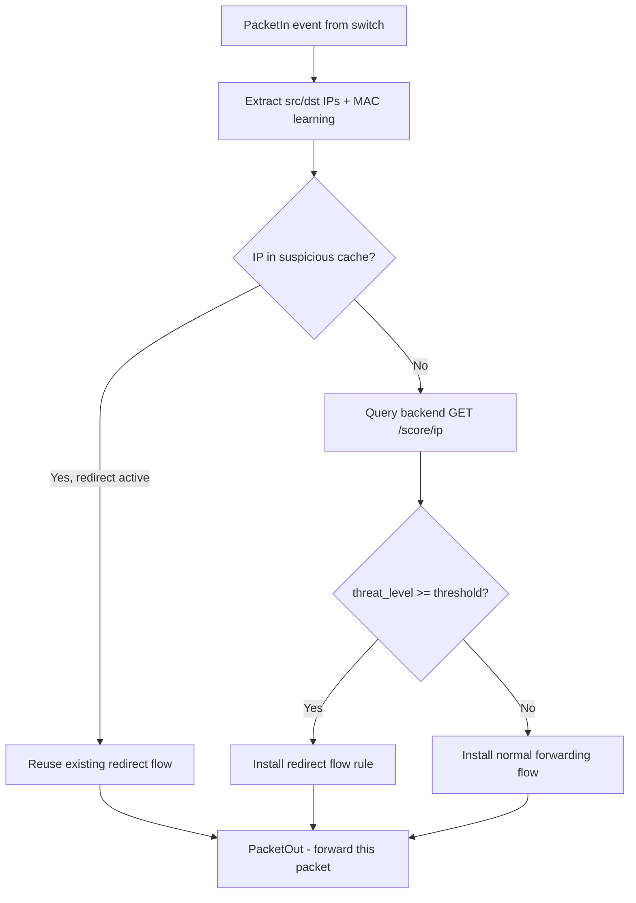
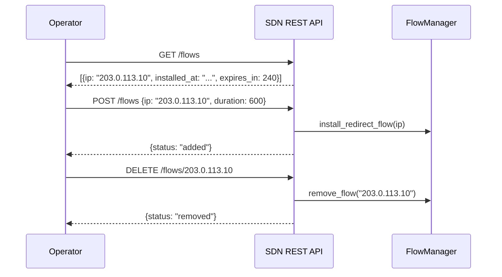

# SDN Controller Design

## What Is SDN? (Beginner Explainer)

**SDN (Software-Defined Networking)** separates the decision-making part of a network (**control plane**) from the packet-forwarding part (**data plane**).

In a traditional network, each switch independently decides where to send packets. In an SDN, a centralised **controller** makes all the routing decisions and pushes them to switches as **flow rules**.

EvilTwin uses this to implement dynamic threat response:
- When an attacker is scored as High/Critical, the SDN controller installs a flow rule that redirects their packets to the honeypot instead of the real network
- The attacker continues interacting with a fake environment while their techniques are recorded
- When the threat score drops (or a time limit expires), the rule is removed and normal routing resumes

**OpenFlow** is the protocol the controller uses to communicate with switches. **Ryu** is the open-source Python framework EvilTwin uses to build the controller.

---

## Purpose

The SDN controller translates threat intelligence into concrete network actions:
1. Continuously queries the backend scoring API for attacker threat levels
2. When a threshold is exceeded, installs redirect flow rules on OpenFlow switches
3. Provides a REST API for operators to view and manually manage flow rules

---

## High-Level Logic



**Why cache suspicious IPs?**
- Reduces backend API calls under heavy traffic — the same attacker may generate hundreds of packets per second
- Prevents repeated flow installation churn — `InstallFlow` is expensive; caching avoids issuing the same rule twice
- The cache TTL (short-lived) ensures stale score data eventually expires

---

## Components

### `controller.py` — Main Ryu Application

Handles the OpenFlow event loop:

- **`EventOFPPacketIn`** — triggered on every new packet the switch cannot handle with existing flow rules
- **IP extraction** — reads source/destination IP from the packet header
- **MAC learning** — records which switch port each MAC address is behind (needed for correct forwarding)
- **Score lookup** — calls `http://backend:8000/score/{ip}` (internal Docker network)
- **Caching** — stores suspicious IP status with TTL to avoid redundant API calls
- **REST endpoints** — exposes `GET /flows`, `POST /flows`, `DELETE /flows/{ip}` for operator management

### `flow_manager.py` — Flow Rule Construction

Responsible for building and issuing OpenFlow messages:

- **`install_redirect_flow(ip, target_port)`** — creates an `OFPFlowMod` message that matches packets from the attacker IP and rewrites the destination to the honeypot port
- **`install_forward_flow(in_port, out_port)`** — creates a standard L2 forwarding rule
- **`remove_flow(ip)`** — deletes the redirect rule for a specific IP

---

## Flow Rule Specification

When an attacker's threat level meets the threshold, this rule is installed:

| Property | Value |
|---|---|
| Match | IPv4 source IP = attacker IP |
| Action | Rewrite destination IP to honeypot, output to honeypot port |
| Priority | `200` (higher than normal forwarding rules at `100`) |
| Idle timeout | `300 seconds` (rule expires if no matching packets for 5 minutes) |
| Hard timeout | `0` (no hard expiry — relies on idle timeout) |

**Why priority 200?** OpenFlow applies the highest-priority matching rule. Since the redirect rule is more specific (matches a single IP) and has higher priority than the catch-all forwarding rule, it always wins for attacker traffic.

---

## REST Control API

Operators can view and manage flow rules without accessing the switch directly:



**Manual flow control is useful when:**
- Automatically-scored threat is under the threshold but an analyst has manual intelligence about an IP
- You need to immediately release an IP that was misclassified as a threat
- Incident response requires holding an attacker in the honeypot for extended investigation

---

## Scoring Threshold

The controller uses `threat_level >= 3` (High) as the default trigger for redirect installation. This is configurable in the controller startup settings.

| Threat Level | Value | SDN Action |
|---|---|---|
| Benign | 0 | Normal forwarding |
| Low | 1 | Normal forwarding |
| Medium | 2 | Normal forwarding |
| High | 3 | **Install redirect rule** |
| Critical | 4 | **Install redirect rule** |

---

## Runtime Validation

A dedicated test (`sdn/tests/validate_runtime.py`) verifies containerised SDN prerequisites:
- Docker Compose configuration validity
- Ryu image build path availability

Opt-in via environment variable to avoid running in unit test contexts:
```bash
RUN_DOCKER_VALIDATION=1 pytest sdn/tests/validate_runtime.py -q
```

---

## Local Testability Without a Real Switch

The Ryu application requires the `ryu` Python package, which installs cleanly inside the Docker container but may not be available in your local virtual environment.

The controller and flow manager modules include **safe import fallbacks** so that:
- Unit tests can import and test the logic without Ryu installed
- CI runs cleanly without a running SDN environment

For full runtime validation, use the Docker container:
```bash
docker compose exec ryu pytest sdn/tests/ -q
```

---

## Hardening Recommendations

Before production deployment:

- [ ] Add authentication to the SDN REST API (`GET /flows`, `POST /flows`) — currently unprotected
- [ ] Add backend API timeout and circuit breaker — if the backend is slow, the controller should degrade gracefully rather than blocking the packet-in loop
- [ ] Track flow inventory in controller logs — log when rules are installed and when they expire (idle timeout fires)
- [ ] Restrict `/flows*` endpoint to the management network via firewall rules
