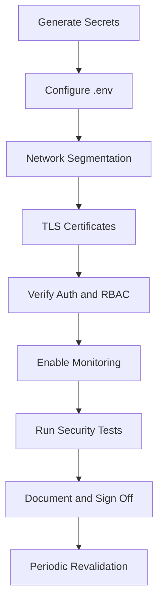

# Security Hardening Checklist

This checklist tracks the security posture of the EvilTwin platform. Items marked **[x]** are already implemented in the codebase. Items marked **[ ]** are recommended before production deployment.

:::tip What does "production ready" mean here?
A deployment is production-ready when all `[ ]` items in this checklist are completed for your specific environment. Items marked `[x]` are already implemented — you just need to configure them correctly.
:::

---

## 1. Configuration and Secrets

- [x] `SECRET_KEY` is used for JWT signing (configured via environment variable)
- [x] `CANARY_WEBHOOK_SECRET` protects webhook endpoint (HMAC-SHA256 verified)
- [ ] `.env` is **not committed** to version control — add to `.gitignore`
- [ ] All secrets are rotated from their default values before deployment
- [ ] `SECRET_KEY` generated with `openssl rand -hex 32` (minimum 32 bytes of entropy)
- [ ] Use a secret manager (AWS Secrets Manager, HashiCorp Vault) for runtime injection in production
- [ ] API keys (`IPINFO_TOKEN`, `ABUSEIPDB_API_KEY`, `SPLUNK_*`, `LLM_API_KEY`) are scoped least privilege

## 2. Authentication and Authorization

:::note What is already implemented
JWT authentication (`POST /auth/login`, `POST /auth/refresh`) and RBAC (role-based access control) are fully implemented. The checklist items below confirm you have configured and tested them correctly.
:::

- [x] JWT Bearer token required on all protected REST endpoints
- [x] RBAC enforced — `admin` role required for sensitive operations (flow control, user management)
- [x] `analyst` role restricted to read-only session/scoring/dashboard queries
- [x] Token refresh endpoint (`POST /auth/refresh`) prevents frequent re-login
- [x] WebSocket connection requires JWT token (`/ws/alerts?token=<jwt>`)
- [x] Canary webhook verified with HMAC-SHA256 signature header
- [x] Canary replay protection — timestamp tolerance window (`CANARY_WEBHOOK_TOLERANCE_SECONDS`)
- [ ] Verify `SECRET_KEY` is unique per environment (dev ≠ staging ≠ production)
- [ ] Verify `ACCESS_TOKEN_EXPIRE_MINUTES` is ≤ 60 for production
- [ ] Create dedicated user accounts per analyst — avoid shared credentials

## 3. Network Segmentation

- [ ] Honeypots are **isolated** from the platform database network
- [ ] `POST /log` is the only ingestion path from the deception network to platform network
- [ ] Controller/API ports are **not** publicly exposed (only via reverse proxy)
- [ ] SDN REST API (`/flows*`) is restricted to the management network (firewall rules)
- [ ] PostgreSQL port (`5432`) is not externally accessible

## 4. Transport Security

- [x] Nginx reverse proxy configuration ships with TLS settings (`infra/nginx/`)
- [ ] TLS certificates installed and auto-renewed (Let's Encrypt `certbot` recommended)
- [ ] All external HTTP traffic redirected to HTTPS (HTTP → HTTPS redirect in nginx)
- [ ] WebSocket served over WSS (`wss://`) in production
- [ ] TLS configuration uses Mozilla Modern profile (TLS 1.2+, no RC4/3DES)
- [ ] Verify with: `curl -I https://your-domain/health`

## 5. CORS Configuration

- [x] `CORS_ORIGINS` environment variable controls allowed origins
- [ ] Set `CORS_ORIGINS` to your exact frontend domain in production (not `*`)
- [ ] Example: `CORS_ORIGINS=https://soc.your-company.com`

## 6. Data Protection

- [ ] Encrypt PostgreSQL storage at rest (cloud: enable encrypted EBS/block storage)
- [ ] Encrypt database backups at rest
- [ ] Define data retention policy — raw logs and session data can grow large
- [ ] Minimise exposure of captured credentials in logs (avoid plaintext logging of `password` fields)

## 7. Runtime Hardening

- [ ] All containers run as **non-root** users (review `Dockerfile` `USER` directives)
- [ ] Base images are pinned to exact version tags (not `latest`)
- [ ] Read-only filesystems for services that don't need writes (`--read-only` in Docker)
- [ ] Container capabilities limited (`--cap-drop ALL` where possible)
- [ ] Resource limits set (`mem_limit`, `cpus`) to prevent runaway containers

## 8. Dependency and Supply Chain

- [x] `ruff` linting enforced in CI (configured in `pyproject.toml`)
- [x] GitHub Actions CI pipeline runs on every PR
- [ ] Enable dependency vulnerability scanning in CI (GitHub Dependabot or `pip-audit`)
- [ ] Use lockfiles (`requirements.txt` pinned, `package-lock.json`) — do not use floating versions in production
- [ ] Review moderate/high CVEs in dependencies quarterly

## 9. Monitoring and Alerting

- [x] `GET /health` endpoint reports database, model, and API status
- [x] Structured logs include `session_id`, `attacker_ip`, `threat_level`
- [ ] Ship structured logs to a centralised platform (Splunk, ELK, CloudWatch)
- [ ] Alert when `/health` returns non-200 for > 2 consecutive checks
- [ ] Alert on sustained `5xx` errors for `/log` endpoint (ingestion pipeline failure)
- [ ] Alert on WebSocket reconnect storm patterns (> N reconnects/minute)

## 10. Incident Readiness

- [x] Incident response runbook documented (`/docs/incident-response-runbook`)
- [x] LLM AI assistant provides session triage and MITRE ATT&CK mapping (`POST /ai/analyze`)
- [ ] Define SLA per threat level: Critical (&lt;15 min response), High (&lt;1h), Medium (&lt;4h)
- [ ] Test backup restore procedure before production goes live
- [ ] Preserve forensic integrity — do not delete raw session logs during active incidents

## 11. Verification Cadence

- [ ] **Weekly**: review dependency vulnerability scan results and Docker image patches
- [ ] **Monthly**: rotate `SECRET_KEY`, `CANARY_WEBHOOK_SECRET`, and external API keys; review analyst accounts
- [ ] **Quarterly**: threat model review; tabletop exercise using the incident response runbook

---

## Quick Verification Commands

Run these to confirm the platform is correctly protected:

```bash
# 1. Auth works
TOKEN=$(curl -s -X POST http://localhost:8000/auth/login \
  -H "Content-Type: application/json" \
  -d '{"username":"admin@example.com","password":"yourpassword"}' \
  | python3 -c "import sys,json; print(json.load(sys.stdin)['access_token'])")
echo "Token acquired: ${TOKEN:0:20}..."

# 2. Protected endpoint requires auth (expect 401 without token)
curl -s http://localhost:8000/sessions | python3 -m json.tool

# 3. Protected endpoint works with token
curl -s -H "Authorization: Bearer $TOKEN" \
  http://localhost:8000/sessions | python3 -m json.tool

# 4. Analyst cannot call admin endpoints (expect 403)
ANALYST_TOKEN=$(curl -s -X POST http://localhost:8000/auth/login \
  -H "Content-Type: application/json" \
  -d '{"username":"analyst@example.com","password":"yourpassword"}' \
  | python3 -c "import sys,json; print(json.load(sys.stdin)['access_token'])")
curl -s -X DELETE -H "Authorization: Bearer $ANALYST_TOKEN" \
  http://localhost:8000/flows/203.0.113.10

# 5. Canary webhook rejects invalid signature (expect 401)
curl -s -X POST http://localhost:8000/canary/webhook \
  -H "Content-Type: application/json" \
  -H "X-Canary-Signature: sha256=invalidsig" \
  -d '{"alert_type":"test","src_ip":"1.2.3.4","timestamp":"2026-01-01T00:00:00Z"}'

# 6. Backend and frontend tests pass
pytest backend/tests -q
cd frontend && npm test -- --run && npm run build
```

---

## Hardening Workflow


