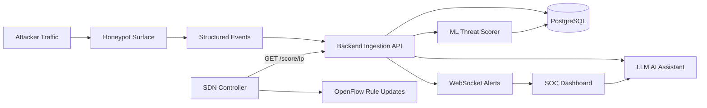
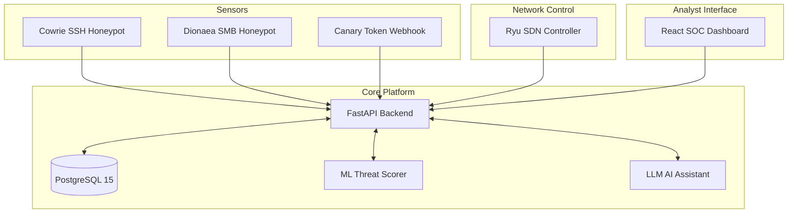
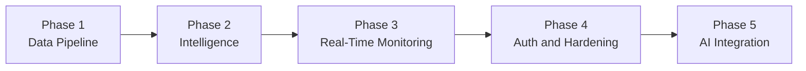

# System Overview

## What Is EvilTwin?

EvilTwin is an **SDN-powered cyber deception platform**. It lures attackers into realistic fake services (called honeypots), records every command they type or file they touch, analyses their behaviour with machine learning and AI, and gives Security Operations Centre (SOC) teams real-time intelligence and automated threat response.

In plain English: EvilTwin turns your attackers into unwitting research subjects. While they think they're compromising a real server, you're silently watching and cataloguing their every move.

## Why Does It Exist?

Traditional security controls (firewalls, IDS/IPS, SIEM rules) are reactive — they detect known threats. EvilTwin is proactive:

| Traditional Approach | EvilTwin Approach |
|---|---|
| Block known bad IPs | Attract attackers and learn their new techniques |
| Detect known signatures | Score behaviour patterns — even novel ones |
| Alert after compromise | Intercept before real assets are reached |
| Manual analyst triage | AI-assisted MITRE ATT&CK mapping |
| Static network rules | Dynamic SDN flow redirection |

EvilTwin is particularly effective against:
- **Low-and-slow intrusions** — attackers who operate below normal detection thresholds
- **Credential spray campaigns** — attackers trying many passwords across many IPs
- **Reconnaissance sessions** — attackers exploring systems before exploiting them
- **VPN-masked adversaries** — EvilTwin detects VPN/Tor and enriches attacker profiles accordingly

## How It Works (At a Glance)

## Core Capabilities

| Capability | What It Does |
|---|---|
| **Multi-sensor ingestion** | Accepts events from Cowrie (SSH/Telnet), Dionaea (SMB/HTTP), Canary tokens, and any custom sensor |
| **Session profiling** | Aggregates attacker behaviour across multiple events into a longitudinal profile |
| **ML threat scoring** | RandomForest model assigns score (0–1) and level (0–4) to each session in real time |
| **LLM AI analysis** | Language model identifies MITRE ATT&CK TTPs, IoCs, and recommends defensive actions |
| **VPN/proxy enrichment** | Integrates with IPInfo and AbuseIPDB to detect anonymised sources |
| **Real-time alerting** | WebSocket feed pushes Critical/High alerts to SOC dashboard instantly |
| **SDN-driven response** | Ryu OpenFlow controller redirects suspicious IPs based on threat scores |
| **Canary token integration** | Alerts when internal decoy credentials or URLs are triggered |
| **RBAC** | `admin` and `analyst` roles with JWT authentication on all endpoints |
| **Splunk integration** | Forwards structured alerts to Splunk SIEM via HTTP Event Collector |
| **SOC dashboard** | React-based real-time dashboard with session explorer, attack map, and AI chat |

## Platform Components

## Threat Model Assumptions

EvilTwin is built with these constraints in mind:

- **All external traffic is untrusted** — attacker payloads may contain injection attempts, hostile strings, or overflow attempts
- **Honeypot logs may contain malicious content** — all incoming JSON is validated by Pydantic schemas; unrecognised fields are stripped
- **Enrichment providers can fail** — VPN detection, IPInfo, and AbuseIPDB degrade gracefully without stopping ingestion
- **ML model may be missing** — the platform continues running; scoring returns conservative defaults
- **LLM may be unavailable** — AI endpoints return 503; all other features continue working

## Security Goals

1. **Separation of deception and platform networks** — a compromised honeypot should not give an attacker access to the database or SDN controller
2. **Resilient ingestion** — events must never be dropped due to scoring or enrichment failures
3. **No implicit trust of attacker data** — all attacker-provided content is treated as hostile input
4. **Deterministic forensic state** — raw events are preserved intact for replay and evidence

## Delivery Phases

EvilTwin was built iteratively:

- **Phase 1**: Honeypot event ingestion, PostgreSQL persistence, session querying
- **Phase 2**: ML threat scoring, VPN enrichment, SDN response path
- **Phase 3**: WebSocket alert feed, SOC dashboard, real-time charts
- **Phase 4**: JWT authentication, RBAC, canary webhook with replay protection, TLS
- **Phase 5**: LLM AI assistant — session forensics, MITRE ATT&CK analysis, AI chat

All phases are complete and operational in the current codebase.
