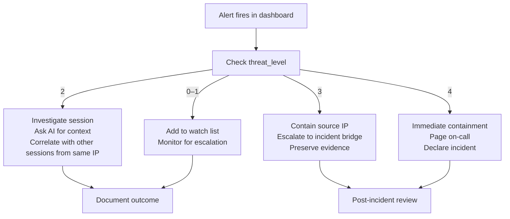

# Incident Response Runbook

This runbook tells SOC analysts exactly what to do, in order, when EvilTwin raises an alert. Each playbook has copy-pasteable commands so you can act quickly without having to remember syntax under pressure.

:::note Before you start
Make sure you have a valid JWT token in your environment. The backend uses **form-encoded OAuth2 login** with the user's **email** as `username`:
```bash
TOKEN=$(curl -s -X POST http://localhost:8000/auth/login \
  -H "Content-Type: application/x-www-form-urlencoded" \
  --data-urlencode "username=analyst@eviltwin.local" \
  --data-urlencode "password=eviltwin-demo" \
  | python3 -c "import sys,json; print(json.load(sys.stdin)['access_token'])")
echo "Token acquired: ${TOKEN:0:20}..."
```
:::

## Severity Model

| Threat Level | What it means | Response SLA |
|---|---|---|
| 0 | Unknown / not yet classified — benign or very early stage | Monitor, no action required |
| 1 | Low-risk scanning — port scans, service probes | Within 60 minutes |
| 2 | Medium suspicious — repeated credential attempts, tool fingerprints | Within 30 minutes |
| 3 | High-risk — downloader execution, privilege escalation, lateral movement | Within 15 minutes |
| 4 | Critical — active exploitation confirmed, C2 communication | Immediate |

## Triage Decision Tree



---

## Playbook 1: High-Risk Command Execution Detected (Level 3–4)

**Signs**: The attacker typed privilege escalation commands (`sudo`, `su`), ran a downloader (`wget`, `curl`), installed a backdoor, or set up persistence (`cron`, `authorized_keys`).

### Step 1: Get the full session context

```bash
# Replace SESSION_ID with the ID from the alert
SESSION_ID="abc123"

curl -H "Authorization: Bearer $TOKEN" \
  http://localhost:8000/sessions/$SESSION_ID | python3 -m json.tool
```

Note: `src_ip`, `threat_level`, `threat_score`, `commands` array, and `first_seen`/`last_seen`.

### Step 2: Ask the AI assistant to analyze this session

```bash
curl -X POST http://localhost:8000/ai/analyze \
  -H "Authorization: Bearer $TOKEN" \
  -H "Content-Type: application/json" \
  -d "{\"session_id\": \"$SESSION_ID\"}"
```

The response will include:
- `summary` — plain-English explanation of what the attacker did
- `ttps` — MITRE ATT&CK techniques observed (e.g., T1059.004 Unix Shell, T1110 Brute Force)
- `iocs` — Indicators of Compromise (IPs, file hashes, URLs)
- `recommended_actions` — What to do next
- `severity` — AI-assessed severity level

### Step 3: Check if SDN has already redirected this IP

```bash
SRC_IP="203.0.113.1"   # From the session's src_ip field

# Check current threat score
curl -H "Authorization: Bearer $TOKEN" \
  http://localhost:8000/score/$SRC_IP | python3 -m json.tool
```

If `threat_level` is 3 or 4 and SDN redirection is enabled, the IP should already be redirected. Verify:

```bash
# Check SDN flow table (Ryu REST API)
curl http://localhost:8080/stats/flow/1
```

### Step 4: Check for other sessions from the same IP

```bash
curl -H "Authorization: Bearer $TOKEN" \
  "http://localhost:8000/sessions?ip=$SRC_IP&page_size=50" | python3 -m json.tool
```

### Step 5: Export evidence for SIEM/ticketing

```bash
# Export session details to a file
curl -H "Authorization: Bearer $TOKEN" \
  http://localhost:8000/sessions/$SESSION_ID > "evidence_${SESSION_ID}_$(date +%Y%m%d).json"
```

### Step 6: Use AI chat for follow-up questions

```bash
curl -X POST http://localhost:8000/ai/chat \
  -H "Authorization: Bearer $TOKEN" \
  -H "Content-Type: application/json" \
  -d '{
    "session_id": "'"$SESSION_ID"'",
    "message": "Is this attacker likely a human operator or automated tool? What is their likely objective?"
  }'
```

---

## Playbook 2: Canary Token Triggered (Any Level)

**What is a canary token?** A canary token (also called a **honeytoken**) is the third honeypot type in EvilTwin. Unlike Cowrie and Dionaea which are network services, a canary is a tracked artifact — a fake credential, document, URL, AWS key, or DNS record planted somewhere an attacker is likely to find it. When the attacker uses the artifact, a webhook fires back to EvilTwin even if they never touched a honeypot service.

**Signs**: Alert message starts with `Canary token triggered:` and the session `honeypot` field equals `canary` (protocol `http`). The alert is created at threat level 3 by default.

### Step 1: Validate the webhook alert is authentic

The webhook includes an HMAC signature. EvilTwin verifies this automatically. If the alert reached the dashboard, the signature was valid.

```bash
# Review the full alert payload
ALERT_ID="canary_alert_id"
curl -H "Authorization: Bearer $TOKEN" \
  http://localhost:8000/alerts/$ALERT_ID | python3 -m json.tool
```

### Step 2: Identify the exposed asset

The canary payload includes:
- `token_id` — which canary was triggered
- `timestamp` — when it was accessed
- `src_ip` — where the trigger came from (may be a proxy)
- `user_agent` — attacker's browser/tool fingerprint

Use `token_id` to identify which document, credential, or file was leaked.

### Step 3: Quarantine and rotate

1. Disable or invalidate the leaked resource immediately
2. If it was a password or API key, rotate it now
3. If it was a file, check if other copies exist and track them too
4. Block the triggering IP at the perimeter firewall

### Step 4: Determine access path

Work backwards: how did the attacker get the canary in the first place?
- Was it in an email? Check email logs.
- Was it in a file share? Check access logs.
- Was it published publicly? Check web crawlers or GitHub.

---

## Playbook 3: VPN / Proxy Detection Spike

**Signs**: Many sessions in a short time from IPs flagged as VPN, Tor, or known proxy services. Threat levels may be lower individually, but aggregate volume suggests coordinated activity.

### Step 1: Survey the current threat landscape

```bash
# Get dashboard statistics
curl -H "Authorization: Bearer $TOKEN" \
  http://localhost:8000/dashboard/stats | python3 -m json.tool

# Get top attacking sources right now
curl -H "Authorization: Bearer $TOKEN" \
  http://localhost:8000/dashboard/top-attackers | python3 -m json.tool
```

### Step 2: Check for correlated behavior

```bash
# Ask AI to assess the overall pattern
curl -X POST http://localhost:8000/ai/chat \
  -H "Authorization: Bearer $TOKEN" \
  -H "Content-Type: application/json" \
  -d '{
    "message": "We are seeing a spike in VPN-flagged sessions from multiple IPs. Is this likely a coordinated scan or opportunistic background noise?"
  }'
```

### Step 3: Adjust detection thresholds if this is a false positive surge

Do not adjust thresholds without a change record. Changes to `THREAT_REDIRECT_THRESHOLD` affect all active redirection.

---

## Quick Reference Commands

```bash
# Platform health
curl -s http://localhost:8000/health

# Dashboard stats (sessions count, top threats)
curl -H "Authorization: Bearer $TOKEN" http://localhost:8000/dashboard/stats

# Top attacking IPs right now
curl -H "Authorization: Bearer $TOKEN" http://localhost:8000/dashboard/top-attackers

# Get threat score for specific IP
curl -H "Authorization: Bearer $TOKEN" http://localhost:8000/score/203.0.113.1

# Get all sessions from specific IP
curl -H "Authorization: Bearer $TOKEN" \
  "http://localhost:8000/sessions?ip=203.0.113.1&page_size=50"

# AI analysis of a session
curl -X POST http://localhost:8000/ai/analyze \
  -H "Authorization: Bearer $TOKEN" \
  -H "Content-Type: application/json" \
  -d '{"session_id": "SESSION_ID_HERE"}'

# AI chat for follow-up questions
curl -X POST http://localhost:8000/ai/chat \
  -H "Authorization: Bearer $TOKEN" \
  -H "Content-Type: application/json" \
  -d '{"message": "Your question here"}'
```

---

## Evidence Collection Minimum

Every incident should preserve at minimum:

- [ ] Alert payload (full JSON including timestamps and threat levels)
- [ ] Session command history and credential attempts for relevant sessions
- [ ] AI analysis output (TTPs, IoCs, recommendations)
- [ ] SDN flow state snapshot at time of incident
- [ ] Backend and controller logs from the incident time window

```bash
# Collect all of the above for a given session
SESSION_ID="your_session_id"
mkdir -p "incident_$(date +%Y%m%d)_${SESSION_ID}"
cd "incident_$(date +%Y%m%d)_${SESSION_ID}"

curl -H "Authorization: Bearer $TOKEN" \
  http://localhost:8000/sessions/$SESSION_ID > session.json

curl -X POST http://localhost:8000/ai/analyze \
  -H "Authorization: Bearer $TOKEN" \
  -H "Content-Type: application/json" \
  -d "{\"session_id\": \"$SESSION_ID\"}" > ai_analysis.json

docker compose logs backend --since="$(jq -r .first_seen session.json)" > backend.log
docker compose logs ryu --since="$(jq -r .first_seen session.json)" > ryu.log
```

---

## Post-Incident Review Template

After every Level 3–4 incident, answer these questions and file them in your incident tracker:

1. **What signal caught the incident first?** (honeypot, canary, dashboard alert, external report)
2. **How long from first event to analyst awareness?** (aim for < 10 minutes for Level 3+)
3. **Was the AI analysis accurate and useful?**
4. **Which response step created the most delay?**
5. **What detection improvement would have caught this earlier?**
6. **Are any docs or runbook steps out of date?**

---

## Recovery Validation Checklist

After containing an incident, verify the platform is healthy:

```bash
# 1. Health check returns healthy
curl -s http://localhost:8000/health

# 2. New events are being processed
curl -H "Authorization: Bearer $TOKEN" \
  "http://localhost:8000/sessions?page=1&page_size=5" | python3 -m json.tool

# 3. WebSocket delivers alerts (check dashboard shows "Connected")

# 4. AI service is responsive
curl -H "Authorization: Bearer $TOKEN" \
  http://localhost:8000/ai/status

# 5. SDN controller is responsive
curl http://localhost:8080/stats/switches
```
