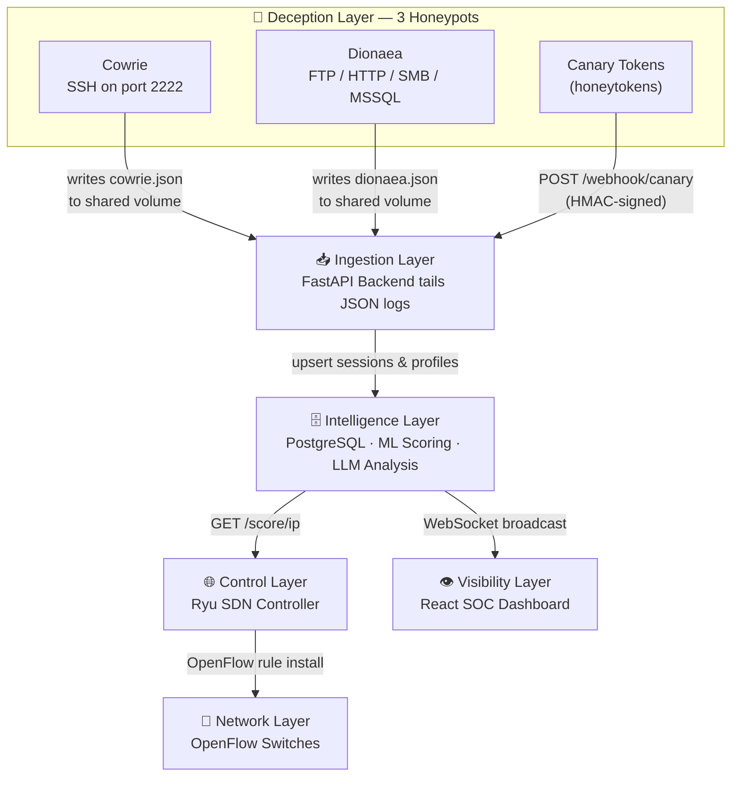

# Welcome to EvilTwin

EvilTwin is a **cyber deception platform** — a security system that lures attackers into fake environments, records everything they do, automatically scores how dangerous they are, and can reroute truly dangerous traffic to contain it — all while your real infrastructure remains untouched.

This portal is the single source of truth for everyone working with EvilTwin: analysts, engineers, operators, and newcomers.

## What Does "Cyber Deception" Mean?

Traditional security tries to keep attackers *out*. Cyber deception takes a different approach: **let attackers in — but into a controlled trap**.

When an attacker discovers what looks like your SSH server or file share and connects to it, they don't realize it is a honeypot (a deliberately fake, monitored system). You record every command they type, every password they attempt, every file they touch. You learn their techniques. When an attacker's behavior crosses a danger threshold, the network itself silently redirects them, keeping them stuck in the trap indefinitely while your real systems stay safe.

## The Five Layers of EvilTwin



| Layer | Purpose | Key Technology |
|---|---|---|
| **Deception** | Presents fake services and tracked assets to attract attackers | Cowrie (SSH), Dionaea (FTP/HTTP/SMB/MSSQL), Canary tokens (honeytokens) |
| **Ingestion** | Tails honeypot JSON logs and receives canary webhooks; validates and persists events | FastAPI, async file tailers, PostgreSQL, Pydantic |
| **Intelligence** | Scores threat severity and explains attacker intent | scikit-learn ML, OpenAI-compatible LLM |
| **Control** | Redirects dangerous traffic to contain attackers | Ryu OpenFlow controller |
| **Visibility** | Shows analysts live and historical threat context | React, Zustand, WebSockets |

:::note What is a canary token?
A **canary token** (or **honeytoken**) is a lightweight honeypot in the form of a tracked artifact — a fake credential, document, URL, API key, or DNS record. The attacker never sees it as a service; they trip it by *using* the planted artifact. When triggered, the token fires an HMAC-signed webhook to `POST /webhook/canary`, which EvilTwin treats as a high-confidence intrusion signal (threat level 3).
:::

## Key Concepts Glossary

New to security platforms? These terms appear constantly throughout the docs.

| Term | What It Means in Plain English |
|---|---|
| **Honeypot** | A fake-but-convincing service (SSH server, SMB share) that records everything attackers do |
| **Canary Token / Honeytoken** | A tracked artifact (file, credential, URL, DNS record) that fires an alert when accessed — a lightweight, asset-based honeypot |
| **SOC** | Security Operations Center — the team or dashboard where analysts monitor threats in real time |
| **SDN** | Software Defined Networking — programming network switches in software rather than configuring them by hand |
| **OpenFlow** | A protocol that lets you tell a network switch exactly how to handle each packet |
| **Threat Level** | An integer 0–4: 0 = unknown/benign, 1 = low, 2 = medium, 3 = high, 4 = active critical exploitation |
| **Threat Score** | A continuous 0.0–1.0 probability of malicious intent, produced by the ML model |
| **JWT** | JSON Web Token — a digitally-signed login ticket that carries your identity and expires automatically |
| **RBAC** | Role-Based Access Control — admin, analyst, and viewer users each have different permissions |
| **WebSocket** | A persistent two-way connection that pushes data instantly — how live alerts reach the dashboard |
| **LLM** | Large Language Model — an AI (GPT-4, Llama, etc.) that reads session data and explains threats in natural language |
| **IoC** | Indicator of Compromise — concrete evidence of an attack: IP addresses, file hashes, domains |
| **TTP** | Tactics, Techniques, and Procedures — the steps attackers use, mapped to the MITRE ATT\&CK framework |
| **MITRE ATT&CK** | An industry-standard catalog of real-world attacker behaviors, referenced as T-numbers (e.g., T1059) |
| **HMAC** | Hash-based Message Authentication Code — a cryptographic signature on a webhook payload to prove authenticity |
| **Rate Limiting** | Capping how many requests a single IP can make per second to prevent abuse |

## Start Here by Role

### 🔍 SOC Analyst — I analyze threats, I don't write code

1. [Getting Started](./getting-started.md) — run the platform from scratch in 10 minutes
2. [System Overview](/dev/system-overview) — understand what the platform does and why
3. [Incident Response Runbook](./incident-response-runbook.md) — exactly what to do when an alert fires
4. [Troubleshooting](./troubleshooting.md) — fix the most common problems
5. [Frontend Design](/dev/frontend-design) — understand every UI element and what it means

### 👨‍💻 Backend Engineer — I build and extend the platform

1. [Developer Onboarding](/dev/developer-onboarding) — productive in 15 minutes
2. [Architecture Overview](/dev/architecture-overview) — service topology, data flow, and trust boundaries
3. [Backend Design](/dev/backend-design) — how the FastAPI service is structured
4. [API Reference](/dev/api-reference) — every endpoint with request/response examples
5. [AI Threat Scoring](/dev/ai-threat-scoring) — the ML model and LLM integration
6. [Testing and Quality](/dev/testing-and-quality) — how to test changes correctly

### 🌐 SDN / Network Engineer — I own the control plane

1. [Architecture Overview](/dev/architecture-overview) — trust boundaries and flow diagrams
2. [SDN Controller](/dev/sdn-controller) — how OpenFlow redirection works step by step
3. [Honeypot Integration](/dev/honeypot-integration) — connecting sensors to the ingestion pipeline
4. [API Reference](/dev/api-reference) — the score lookups the controller depends on
5. [Operations and Deployment](./operations-and-deployment.md) — running the stack in production

### 🏗️ Platform Operator — I deploy, monitor, and harden the platform

1. [Getting Started](./getting-started.md) — initial setup
2. [Operations and Deployment](./operations-and-deployment.md) — day-to-day operations and runbooks
3. [Environment Configuration](/dev/environment-configuration) — every environment variable documented
4. [Security Hardening Checklist](/dev/security-hardening-checklist) — production readiness checklist
5. [Observability and SLOs](/dev/observability-and-slos) — monitoring, alerting, and reliability targets

## Quick Validation Commands

Run these from the repository root to confirm the platform is healthy at any time:

```bash
# Is the backend running and healthy?
curl -s http://localhost:8000/health

# Run all backend unit and integration tests
pytest backend/tests -q

# Run all SDN tests
pytest sdn/tests -q

# Run frontend tests and verify the production build
cd frontend && npm test -- --run && npm run build

# Build the documentation site (checks for broken links and syntax)
cd docs-site && npm run build
```

## Canonical Documentation Policy

- All user-facing docs live in `/docs-site/docs/`.
- All developer-facing docs live in `/docs-site/dev/`.
- Docusaurus renders both directories directly — never maintain parallel copies elsewhere.
- When code behavior changes, the corresponding doc update must be included in the same pull request.
- Run `npm run build` in `docs-site/` before merging any doc change to catch broken links and Mermaid syntax errors.
