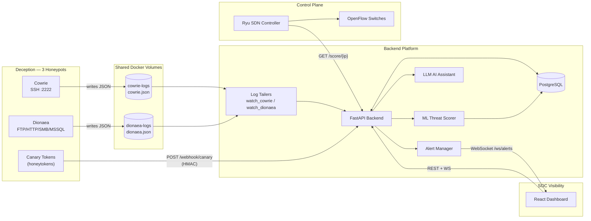
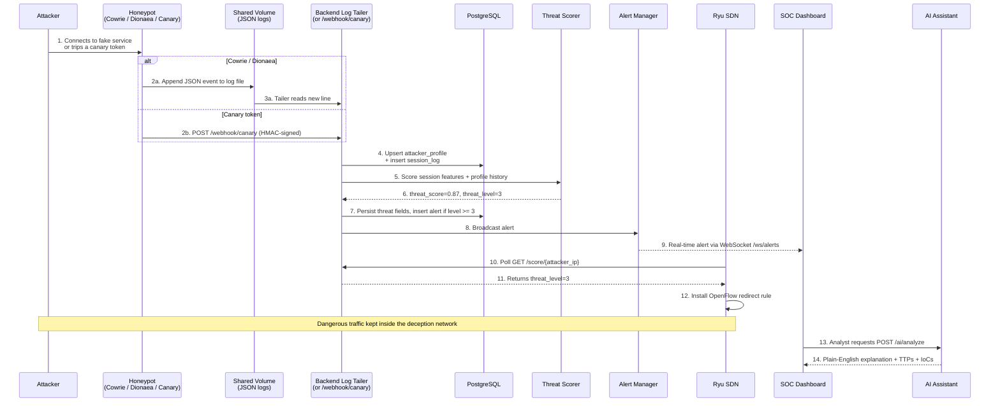

# EvilTwin Master Guide

This is the single-entry guide for understanding, developing, operating, and securing the EvilTwin platform. Whether you are new to the project or returning after months away, start here.

## What Problem Does EvilTwin Solve?

Traditional security tools watch for known-bad signatures. They struggle with:

- **Slow reconnaissance** — attackers probing over days, below detection thresholds
- **Zero-day behavior** — novel attacks with no known signature
- **Attribution gaps** — VPN and proxy usage masking attacker identity
- **Dwell time** — attackers already inside, moving quietly for weeks

EvilTwin addresses this by creating **controlled adversarial interaction surfaces** — services that look real but are monitored traps. Every connection is an opportunity to learn attacker techniques, measure threat severity, and respond proportionally.

## Platform in One Paragraph

EvilTwin captures attacker interactions across three honeypot types — Cowrie (SSH), Dionaea (FTP/HTTP/SMB/MSSQL), and canary tokens (honeytokens) — ingests those events into a FastAPI backend (by tailing the honeypots' JSON logs from shared Docker volumes and by receiving HMAC-signed canary webhooks), stores everything in PostgreSQL, scores threat severity with a scikit-learn model, surfaces real-time context to SOC analysts via a React dashboard over WebSockets, enables an LLM-powered assistant to explain threats in natural language, and exposes a `GET /score/{ip}` endpoint that the Ryu SDN controller polls to install OpenFlow redirection rules for the most dangerous sources.

## End-to-End Architecture



## Why This Architecture Works

| Design Decision | Reason |
|---|---|
| **Evidence-first storage** | Raw events are preserved in JSONB for forensic replay |
| **Risk-first scoring** | ML score and 0–4 threat level support prioritized response |
| **Control-loop ready** | SDN controller polls the score API and reacts near-real-time |
| **Fault-tolerant** | ML or enrichment failures degrade safely to conservative defaults |
| **Observable by design** | Every subsystem emits structured logs for centralized monitoring |
| **Beginner-auditable** | Pydantic validates all inputs at the boundary; ORM prevents SQL injection |

## The Core Data Flow — Step by Step

Here is exactly what happens when an attacker interacts with one of the three honeypots:



## Authentication and Access Control

EvilTwin uses **JWT (JSON Web Token) authentication** with **RBAC (Role-Based Access Control)**:

:::note What is JWT?
After you log in with a username and password, the server returns a signed token (a long string). You include this token in every API request (`Authorization: Bearer <token>`). The server verifies the signature to confirm your identity — no database lookup needed. Tokens expire automatically (default: 30 minutes) for security.
:::

| Role | Can do |
|---|---|
| `admin` | Everything including user management and configuration |
| `analyst` | View sessions, alerts, dashboard, request AI analysis, query scores |
| `viewer` | Read-only access to sessions and dashboard |

## Role-Based Reading Paths

### Security Analyst

Goal: triage attacks quickly and interpret threat signals.

1. [Getting Started](./getting-started.md) — run the platform
2. [System Overview](/dev/system-overview) — understand what each component does
3. [Frontend Design](/dev/frontend-design) — every dashboard element explained
4. [Incident Response Runbook](./incident-response-runbook.md) — what to do when alerts fire
5. [Troubleshooting](./troubleshooting.md) — common problems and fixes

### Backend Engineer

Goal: implement and validate ingestion, scoring, and AI behavior.

1. [Architecture Overview](/dev/architecture-overview) — service topology and trust boundaries
2. [Backend Design](/dev/backend-design) — FastAPI structure, data models, lifecycle
3. [AI Threat Scoring](/dev/ai-threat-scoring) — ML model and LLM integration
4. [API Reference](/dev/api-reference) — every endpoint documented
5. [Testing and Quality](/dev/testing-and-quality) — unit, integration, and CI pipeline

### SDN / Network Engineer

Goal: ensure threat-driven redirection works safely and predictably.

1. [Architecture Overview](/dev/architecture-overview) — trust boundaries and flow diagrams
2. [SDN Controller](/dev/sdn-controller) — the Ryu controller logic
3. [API Reference](/dev/api-reference) — the `/score/{ip}` contract the controller depends on
4. [Operations and Deployment](./operations-and-deployment.md) — networking in Docker Compose

### Platform Operator

Goal: run, harden, and monitor the stack reliably.

1. [Developer Onboarding](/dev/developer-onboarding) — initial environment setup
2. [Environment Configuration](/dev/environment-configuration) — every variable explained
3. [Operations and Deployment](./operations-and-deployment.md) — startup, migrations, runbooks
4. [Security Hardening Checklist](/dev/security-hardening-checklist) — production readiness
5. [Observability and SLOs](/dev/observability-and-slos) — what to monitor and alert on

## API Entry Points

| Endpoint Group | Purpose | Auth Required |
|---|---|---|
| `POST /auth/register` | Create a user account | No |
| `POST /auth/login` | Get a JWT access token (form-encoded: `username`=email, `password`) | No |
| `POST /auth/refresh` | Renew an expired access token | Refresh token |
| `POST /log` | Ingest a honeypot event (used internally / for tests — production uses log tailers) | No (internal only) |
| `GET /sessions` | Browse attack sessions | Yes |
| `GET /score/{ip}` | Get threat score for an IP | Yes |
| `GET /dashboard/stats` | Aggregated statistics | Yes |
| `WS /ws/alerts` | Live alert stream | Yes (token param) |
| `POST /ai/analyze` | AI analysis of a session | Yes |
| `POST /ai/chat` | Conversational threat intel | Yes |
| `POST /webhook/canary` | Receive canary token triggers (the 3rd honeypot) | HMAC signature |

Full request/response documentation: [API Reference](/dev/api-reference).

## Quality Gate Checklist

Run this before merging any substantial change:

```bash
# Step 1: Backend linting (ruff catches style and security issues)
ruff check backend/ sdn/
ruff format --check backend/ sdn/

# Step 2: Backend unit and integration tests
pytest backend/tests -q

# Step 3: Frontend type checking, tests, and build
cd frontend
npx tsc --noEmit           # TypeScript type errors
npm test -- --run          # Vitest unit tests
npm run build              # Verifies production build succeeds

# Step 4: SDN unit tests
cd ..
pytest sdn/tests -q

# Step 5: Documentation build (catches broken links and Mermaid errors)
cd docs-site && npm run build
```

## Quick Start Commands

```bash
# 1. Copy and edit configuration
cp .env.example .env

# 2. Start core services
docker compose up --build -d postgres backend cowrie ryu

# 3. Run database migrations
docker compose exec backend alembic upgrade head

# 4. Check health
curl -s http://localhost:8000/health

# 5. Start the frontend dashboard
cd frontend && npm install && npm run dev
# Open: http://localhost:5173
```

## Security and Hardening Summary

The most important production readiness items:

1. [x] JWT authentication on all API endpoints
2. [x] Role-based access control (admin / analyst / viewer)
3. [x] HMAC signature verification on canary webhooks
4. [x] Canary replay attack protection (timestamp window)
5. [x] WebSocket authentication via token parameter
6. [x] Rate limiting on authentication endpoints
7. [ ] TLS/HTTPS via nginx in production
8. [ ] Honeypot network isolated from management network
9. [ ] Secrets loaded from environment manager (not hardcoded)
10. [ ] Centralized log aggregation (Splunk or equivalent)

Full checklist: [Security Hardening Checklist](/dev/security-hardening-checklist).

## Change Management

When you modify a subsystem, update the corresponding docs in the same pull request:

| What changed | Docs to update |
|---|---|
| New API endpoint | [API Reference](/dev/api-reference) |
| New environment variable | [Environment Configuration](/dev/environment-configuration) |
| Architecture change | [Architecture Overview](/dev/architecture-overview) |
| New failure mode | [Troubleshooting](./troubleshooting.md) |
| New security control | [Security Hardening Checklist](/dev/security-hardening-checklist) |

## Canonical Documentation Policy

- User-facing docs live in `/docs-site/docs/`
- Developer-facing docs live in `/docs-site/dev/`
- Docusaurus renders both — run `npm run build` to validate
- Do not maintain parallel documentation copies elsewhere
