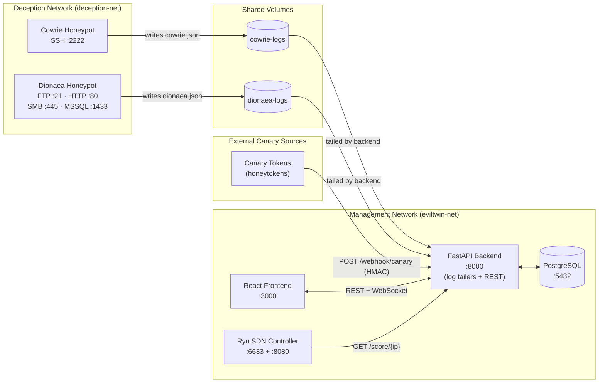

# Operations and Deployment Guide

This guide covers everything an operator needs to run EvilTwin: bootstrapping the environment, performing database migrations, running in production with TLS, and handling day-2 operational tasks like backups and scaling.

---

## Understanding the Service Topology

EvilTwin is a multi-service application orchestrated with Docker Compose. Three deception sources feed one backend, which serves the dashboard and the SDN controller. Cowrie and Dionaea write JSON logs to **shared Docker volumes**; the backend tails those volumes. Canary tokens use an HTTP webhook instead.



:::warning Important: Network Isolation
In production, the Deception Network (honeypots) must be on a separate network segment from the Management Network. This prevents a compromised honeypot from communicating directly with the backend database or SDN controller.
:::

---

## Bootstrap Checklist (Day 0)

Run these steps in order the first time you deploy EvilTwin.

### Step 1: Prepare Environment Variables

```bash
# Copy the example and edit with your values
cp .env.example .env
```

Required values to set (the deployment will not work safely until these are changed):

| Variable | What to set it to |
|---|---|
| `POSTGRES_PASSWORD` | A strong random password — `openssl rand -hex 20` |
| `SECRET_KEY` | A random 32-byte hex string — `openssl rand -hex 32` |
| `CANARY_WEBHOOK_SECRET` | A random 32-byte hex string — `openssl rand -hex 32` |

:::tip Generating secure secrets
```bash
openssl rand -hex 32   # Use this output for SECRET_KEY and CANARY_WEBHOOK_SECRET
openssl rand -hex 20   # Use this output for POSTGRES_PASSWORD
```
:::

### Step 2: Check for Port Conflicts

EvilTwin uses several ports. Verify they are free before starting:

```bash
# Check which ports are in use
ss -tlnp | grep -E '22|23|80|445|5432|6633|8000|8080'
```

If any port is in use by another service, edit `docker-compose.yml` to change the host-side binding.

### Step 3: Build and Start Services

```bash
# Build all container images and start in the background
docker compose up --build -d

# Watch the startup progress
docker compose logs -f --tail=50
```

You should see each service reach a `healthy` or `running` state within 60 seconds.

### Step 4: Run Database Migrations

EvilTwin uses **Alembic** to manage the database schema. Think of Alembic as "git for your database structure" — each migration is a versioned change to the schema.

```bash
# Apply all pending migrations to create tables and indexes
docker compose exec backend alembic upgrade head
```

You should see output like:
```
INFO  [alembic.runtime.migration] Running upgrade  -> abc123, Initial schema
INFO  [alembic.runtime.migration] Running upgrade abc123 -> def456, Add threat fields
```

:::note What is "head"?
`head` means "apply all migrations up to the latest version." If you re-run this command later, it will only apply new migrations — it won't touch existing data.
:::

### Step 5: Verify Health

```bash
# Should return {"status": "healthy", "database": true, ...}
curl -s http://localhost:8000/health | python3 -m json.tool

# Should return HTTP 200 with version info
curl -I http://localhost:8000/
```

### Step 6: Create Your First User Account

```bash
# Register an analyst account (the backend uses email-based auth)
curl -X POST http://localhost:8000/auth/register \
  -H "Content-Type: application/json" \
  -d '{"email": "admin@eviltwin.local", "password": "StrongPass123!", "role": "admin"}'

# Log in to receive a JWT access token (form-encoded, OAuth2-password style)
curl -X POST http://localhost:8000/auth/login \
  -H "Content-Type: application/x-www-form-urlencoded" \
  --data-urlencode "username=admin@eviltwin.local" \
  --data-urlencode "password=StrongPass123!"
# Save the "access_token" from the response — you will need it for API calls
```

### Step 7: Validate Ingestion and Scoring

In production, Cowrie and Dionaea events flow in automatically as the honeypots write JSON to shared volumes — the backend tails those files. To smoke-test ingestion without waiting for an attacker, you can post a synthetic event to the internal `/log` endpoint:

```bash
TOKEN="your_access_token_here"

# Send a synthetic honeypot event (the same shape the tailers produce)
curl -X POST http://localhost:8000/log \
  -H "Content-Type: application/json" \
  -d '{
    "src_ip": "203.0.113.99",
    "dst_ip": "10.0.1.10",
    "protocol": "ssh",
    "sensor_id": "cowrie-test",
    "timestamp": "2026-01-15T10:00:00Z",
    "payload": {"event": "login_attempt", "username": "root", "password": "admin"}
  }'

# Check that the session was created
curl -s http://localhost:8000/sessions \
  -H "Authorization: Bearer $TOKEN" | python3 -m json.tool
```

---

## Production Deployment

### Using docker-compose.prod.yml

The `docker-compose.prod.yml` file adds production-specific configuration:

- No exposed ports from Postgres (database not accessible externally)
- Frontend served by nginx
- TLS termination via nginx

```bash
# Start with production configuration
docker compose -f docker-compose.prod.yml up --build -d
```

### TLS Certificate Setup

EvilTwin uses nginx to terminate HTTPS in production. You need certificates before starting.

**Option A: Let's Encrypt (public domain)**

```bash
# Install certbot
dnf install certbot         # Fedora/RHEL

# Obtain a certificate
certbot certonly --standalone -d yourdomain.com

# Certificates will be at:
# /etc/letsencrypt/live/yourdomain.com/fullchain.pem
# /etc/letsencrypt/live/yourdomain.com/privkey.pem
```

**Option B: Self-signed (internal/testing)**

```bash
mkdir -p infra/nginx/certs
openssl req -x509 -newkey rsa:4096 -keyout infra/nginx/certs/privkey.pem \
  -out infra/nginx/certs/fullchain.pem -days 365 -nodes \
  -subj "/CN=eviltwin.internal"
```

After generating certificates, set in `.env`:

```bash
NGINX_CERT_PATH=/etc/letsencrypt/live/yourdomain.com/fullchain.pem
NGINX_KEY_PATH=/etc/letsencrypt/live/yourdomain.com/privkey.pem
```

### Nginx Configuration

The nginx reverse proxy handles:

- HTTPS termination (port 443)
- HTTP → HTTPS redirect (port 80)
- WebSocket upgrade pass-through for `/ws/alerts`
- Rate limiting on auth endpoints

Check `infra/nginx/nginx.conf` for the full configuration.

---

## Day-2 Operations

### Checking Service Status

```bash
# See all container states and health checks
docker compose ps

# Check logs for a specific service
docker compose logs backend --tail=100
docker compose logs cowrie --tail=50
docker compose logs ryu --tail=50

# Follow logs in real time
docker compose logs -f backend
```

### Updating the Application

```bash
# Pull latest code
git pull

# Rebuild and restart (zero-downtime not supported — brief interruption expected)
docker compose up --build -d

# Always run migrations after code updates
docker compose exec backend alembic upgrade head
```

### Database Backup

```bash
# Create a compressed backup with timestamp
docker compose exec postgres pg_dump -U "${POSTGRES_USER}" "${POSTGRES_DB}" \
  | gzip > "backup_$(date +%Y%m%d_%H%M%S).sql.gz"

# List existing backups
ls -lh backup_*.sql.gz
```

### Database Restore

```bash
# CAUTION: This replaces the current database content
gunzip -c backup_20240115_120000.sql.gz \
  | docker compose exec -T postgres psql -U "${POSTGRES_USER}" "${POSTGRES_DB}"
```

### Scaling the Backend

The FastAPI backend can run multiple workers for higher throughput:

```bash
# In docker-compose.yml, change the backend command to:
# command: gunicorn main:app -w 4 -k uvicorn.workers.UvicornWorker --bind 0.0.0.0:8000
```

For horizontal scaling (multiple backend containers), a load balancer is required in front. PostgreSQL connection pooling (PgBouncer) is recommended when running more than 4 workers.

---

## Operational Runbooks

### Runbook A: Ingestion Not Updating Sessions

**Symptom**: POST to `/log` succeeds (200) but no sessions appear in `/sessions`.

| Step | Command |
|---|---|
| 1. Check backend logs for errors | `docker compose logs backend --tail=200` |
| 2. Verify migrations are applied | `docker compose exec backend alembic current` |
| 3. Query with broad date range | `curl "http://localhost:8000/sessions?page=1&page_size=25"` |
| 4. Check database directly | `docker compose exec postgres psql -U eviltwin -c "SELECT COUNT(*) FROM session_logs;"` |

### Runbook B: SDN Not Redirecting Suspicious Traffic

**Symptom**: High threat-level IPs are not being blocked/redirected.

| Step | Command |
|---|---|
| 1. Check the score for the IP | `curl -H "Authorization: Bearer $TOKEN" http://localhost:8000/score/203.0.113.1` |
| 2. Verify redirect threshold | Check `THREAT_REDIRECT_THRESHOLD` in `.env` |
| 3. Inspect installed flows | `curl http://localhost:8080/stats/flow/1` |
| 4. Check controller logs | `docker compose logs ryu --tail=100` |

### Runbook C: Frontend Not Receiving Live Alerts

**Symptom**: Dashboard shows "Disconnected" or alerts appear delayed.

| Step | Command |
|---|---|
| 1. Verify backend is running | `curl -s http://localhost:8000/health` |
| 2. Check WebSocket auth | Ensure browser has valid JWT (check DevTools → Application → Local Storage) |
| 3. Verify WebSocket URL | Check `VITE_WS_URL` in frontend `.env` |
| 4. Watch backend WS logs | `docker compose logs backend --tail=50` |

### Runbook D: Authentication Failures (401 Unauthorized)

**Symptom**: API calls return `401 Unauthorized`.

| Step | Action |
|---|---|
| 1. Check token expiry | JWT access tokens expire after 30 minutes (configurable) |
| 2. Refresh the token | `POST /auth/refresh` with your refresh token |
| 3. Verify SECRET_KEY | If `SECRET_KEY` changed, all existing tokens are immediately invalidated |
| 4. Re-login | `POST /auth/login` to get a new token pair |

### Runbook E: AI Endpoints Return 503

**Symptom**: `POST /ai/analyze` or `POST /ai/chat` returns `503 Service Unavailable`.

| Step | Action |
|---|---|
| 1. Check AI status | `curl -H "Authorization: Bearer $TOKEN" http://localhost:8000/ai/status` |
| 2. Verify LLM config | Check `LLM_API_KEY` and `LLM_BASE_URL` in `.env` |
| 3. Test LLM connectivity | `curl -H "Authorization: Bearer $LLM_API_KEY" "$LLM_BASE_URL/models"` |
| 4. Check backend logs | `docker compose logs backend --tail=50 | grep -i "llm\|openai\|ai"` |
